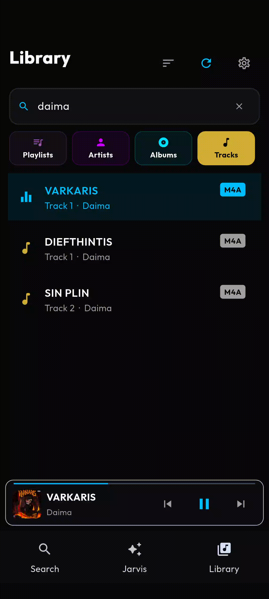

# Mai-An Lab: Streamrip on your phone

[](https://opensource.org/licenses/MIT)
[](https://developer.android.com/about/versions/11)
[](https://www.python.org/)
[](https://flet.dev)
[](https://github.com/nathom/streamrip)

Mai-An Lab brings the full **[streamrip](https://github.com/nathom/streamrip)** download engine to Android. It is the first port of streamrip to a real mobile runtime, wrapped in a lightweight, glassmorphic player built on [Flet](https://flet.dev/); complete with the state-of-the-art Jarvis hands-free voice assistant featuring tactile Push-to-Talk gestures and local recursive NLP parsing, a fast indexer, a triggers-driven SQLite/FTS5 search layer, a customizable player, and an experimental auto-playlist engine borrowed from bioinformatics clustering.

<p align="center">
  
</p>

> [!NOTE]
> I am a bioinformatician by training, not a professional software engineer. This is a non-professionally driven passion project; please take this into consideration when encountering any issues or bugs. Any advice or willingness to contribute is greatly appreciated.

---

## Headline Features

> [!IMPORTANT]
> **Streamrip on Mobile**; this project is a custom-patched port of `streamrip 2.1.0`. We've stripped the `aiodns` C-extensions and relaxed dependency bounds to make the entire stack survive the Flutter/Android build process. Qobuz is supported natively out of the box.

- **Jarvis Hands-Free Voice Assistant**; a state-of-the-art on-device voice assistant powered by Android's highly optimized, native Speech-to-Text (`SpeechRecognizer`) and Text-to-Speech (`TextToSpeech`) hardware engines. Features boundary-anchored local NLP, tactile Push-to-Talk hold gestures, recursive voice hesitation stripping, and priority audio focus ducking to control queues, walk similarity graphs, and queue offline downloads completely hands-free.
- **Lightweight, customizable player**; a glassmorphic Flet UI with micro-animations and a modular design-token system you can re-skin without touching layout code.
- **Fast indexing and search**; recursive library scans use hierarchical in-memory caches and a bulk-import mode that drops triggers during ingest, indexing 10k+ tracks in seconds.
- **Efficient SQL database**; a single `aiosqlite` connection with WAL journaling and a 64 MB page cache ensures the UI never blocks on heavy indexing tasks.
- **Personalized UI**; choose your default startup page, re-skin with a single accent color, and manage advanced Streamrip TOML settings directly in-app.

---

## Documentation (Wiki)

For detailed information on the internals of Mai-An Lab, please refer to the following documentation:

- [System Architecture & Database Design](./docs/Architecture.md)
- [Jarvis Voice Assistant & Background Pipelines](./docs/Development_Reference.md#5-jarvis-voice-assistant--background-pipelines)
- [Auto-Playlist Engine & DSP Deep-Dive](./docs/Auto_Playlist_Engine.md)
- [UI Instructions: Library & Search](./docs/UI_Instructions.md)
- [Build & Deployment Guide](#build-and-deployment)

---

## Verified Environment

This application has been strictly tested and verified on the following hardware/software stack:
- **Device**: Google Pixel 8
- **OS**: Android 16 (Developer Preview)
- **Build Number**: CP1A.260405.005

**Baseline Performance**: ~20% baseline CPU usage, pagination in library and streamrip search views leads to minimal CPU spikes; in edge cases, CPU usage spikes up to 50% with excessive / forced constant scrolling through UI.

---

## Built With

| Component | Technology |
|---|---|
| **Logic** | [Serious Python](https://github.com/flet-dev/serious-python) (CPython 3.11 ARM64) |
| **UI Framework** | [Flet](https://flet.dev/) (Flutter backend) |
| **Audio Engine** | [Just Audio](https://pub.dev/packages/just_audio) + ExoPlayer |
| **Persistence** | [AioSQLite](https://github.com/omnilib/aiosqlite) (SQLite + FTS5) |
| **Analytics** | [NumPy](https://numpy.org/) (Pure-Python DSP) |

---

## Build and Deployment

### Prerequisites

To build the application for Android, ensure the following toolchain is installed on your machine:

| Tool | Requirement |
|---|---|
| **Python** | 3.11+ (must match Serious Python's embedded interpreter) |
| **Flutter SDK** | Latest stable; `flutter` must be in your `PATH` |
| **Android SDK & NDK** | Latest Command Line Tools; `ANDROID_HOME` must be set |
| **Flet** | Install via `pip install flet` |
| **ADB** | Included with Android SDK Platform Tools |

### Android Build

Built with `serious-python` to embed CPython into the Flutter/Flet runtime.

> [!NOTE]
> This project uses a custom local extension (`flet_audio_service`). To ensure the path is resolved correctly on your machine, use the provided build scripts:

**Windows (PowerShell):**
```powershell
cd StreamripApp
.\build_android.ps1
```

**macOS / Linux (Shell):**
```bash
cd StreamripApp
chmod +x build_android.sh
./build_android.sh
```

> [!IMPORTANT]
> **Fresh Rebuilds**; these scripts automatically wipe the `build/` directory and `.gradle/` cache, kill hung Java processes, and uninstall previous versions from your device to ensure a 100% clean installation every time.

---

## Permissions

| Permission | Purpose | Android Version |
|---|---|---|
| `INTERNET` | Streaming metadata and downloading media | All |
| `READ_MEDIA_AUDIO` | Required for indexing and accessing local music files | 13+ |
| `MANAGE_EXTERNAL_STORAGE` | Required for recursive indexing of music folders (All Files Access) | 11+ |
| `FOREGROUND_SERVICE` | Required for persistent background playback | All |
| `FOREGROUND_SERVICE_MEDIA_PLAYBACK` | Specific service type required for background media playback | 14+ |
| `POST_NOTIFICATIONS` | Required to show playback controls in the notification shade | 13+ |
| `WAKE_LOCK` | Prevents the CPU from sleeping during high-fidelity downloads | All |
| `READ_EXTERNAL_STORAGE` | Legacy filesystem access (superseded by `READ_MEDIA_AUDIO`) | < 13 |

---

## License

Distributed under the MIT License. See `LICENSE` for details.

---

## Disclaimer

This is a modified version of the original Streamrip project. I take no credit for the original code. I just modified it to my needs and added a music player on top of it. 

As the creator of Streamrip notes: 
> **I will not be responsible for how you use streamrip. By using streamrip, you agree to the terms and conditions of the Qobuz API.**

---

## Credits

Thank you to the open-source communities of Streamrip and Flet for providing the tools and libraries that make my project possible.
