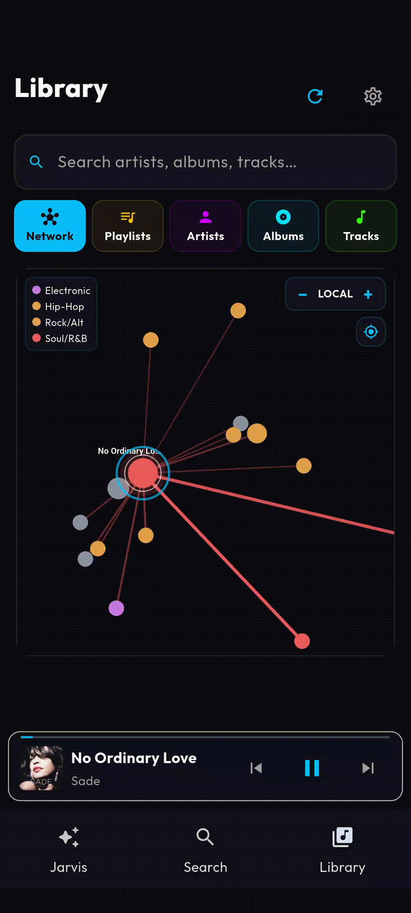
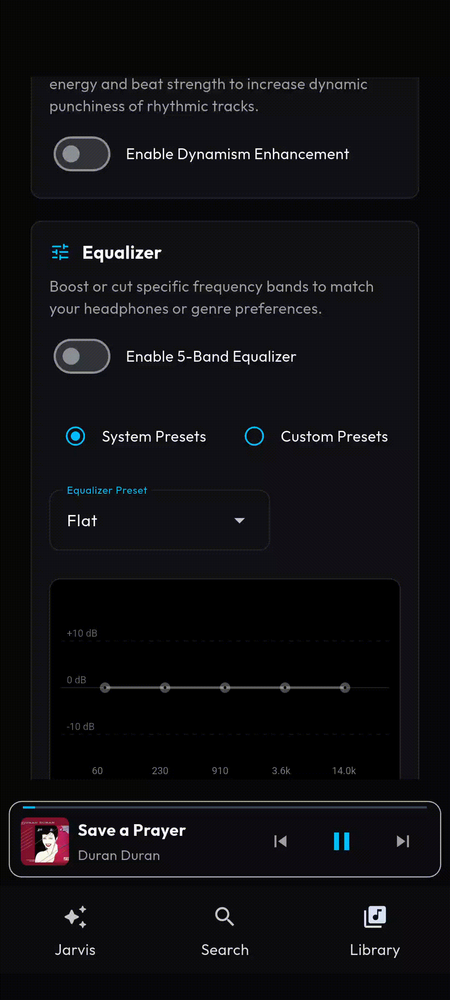

# Mai-An Lab: Dual-Platform Streamrip Music Player (Android & macOS)

[](https://opensource.org/licenses/MIT)
[](https://developer.android.com/about/versions/11)
[](https://www.apple.com/macos/)
[](https://www.python.org/)
[](https://flet.dev)
[](https://github.com/nathom/streamrip)

[**Latest Release**](https://github.com/cmitsakopoulos/Mai-An-Lab/releases/latest)

Mai-An Lab is a dual-platform music player and streamrip download client for Android and macOS. It embeds the streamrip download toolset in an interactive interface built with Flet.

The player implements native engine fallbacks; background services and hardware speech engines on mobile, and an Apple `AVAudioPlayer` loop on desktop. It features a Jarvis styled voice assistant, SQLite library search, and an auto-playlist engine based on $k$-NN acoustic similarity.

## Developer Note

> [!NOTE]
> I am a bioinformatician by training, not a professional software engineer. This is a non-professionally driven passion project; please take this into consideration when encountering issues. Any advice or willingness to contribute is appreciated.

## Interactive UI Panes

### Search & Downloader

Search across streaming endpoints, preview snippets, and download albums or tracks to your system directory. Features an interactive connection progress card showing real-time query states, paired with visual download progress tracking.

<p align="center">
  
</p>

---

### Music Library & Playback Controls

Browse your catalog by artist, album, or track through SQL joins. The playback pane sits alongside the library, providing full queue management, scrubbing, and volume control.

- **Acoustic Similarity Walks**: Generate adaptive playlists on the fly seeded from a single track. The player traverses the unified $Z_r$ similarity network using a personalized-PageRank random walk with self-tuning Gaussian kernel affinities, MMR diversity checks, and Louvain community boundaries for cohesive transitions.

<p align="center">
  
  &nbsp;
  
</p>

---

### Interactive Acoustic Network Graph *(v1.3.0)*

Explore your music library mapped as an interactive 2D force-directed similarity graph. Includes two visualization modes: **Local** (plots the seed track and its 1-hop nearest neighbors) and **Walk** (visualizes the active similarity walk path), colored by Louvain genre communities. Double-clicking any node starts playback immediately.

<p align="center">
  
</p>

---

### Audio Equalizer & Real-time DSP *(v1.2.0)*

Fine-tune your listening experience via a manual 5-band Equalizer and real-time DSP settings. Toggles between System and Custom presets, features precise keyboard-editable gains, and incorporates Dynamism Enhancement to automatically boost rhythmic track punchiness with a live decibel boost monitor.

<p align="center">
  
</p>

---

### Jarvis Voice Assistant

Use voice controls or chat to walk similarity graphs, search tracks, manage queues, make playlists, queue recommendations, and trigger downloads — all via local keyword parsing and audio focus ducking. Say "Hello" and see what happens.

<p align="center">
  
</p>

---

### PCA & Covariance Analysis *(v1.1.0)*

After every library rebuild the PCA engine generates four diagnostic figures (written to `<library>/pca_report/`) showing the full and pruned feature spaces. These plots expose which acoustic features survive the unsupervised Pearson correlation cleaving pass ($|r| \ge 0.85$) and how the surviving dimensions separate your tracks in the orthogonal projection.

**Correlation Heatmaps** — Pearson $r$ across all 8 raw features (left: full space, right: after redundant-feature pruning):

<p align="center">
  
  &nbsp;
  
</p>

**PCA Biplots** — Tracks projected onto PC1/PC2; arrows are feature loading vectors coloured by energy (left: full, right: pruned after cleaving):

<p align="center">
  
  &nbsp;
  
</p>

See [PCA Engine & Unsupervised Feature Cleaving](./docs/Auto_Playlist_Engine.md#8-pca-engine--unsupervised-feature-redundancy-cleaving-v110) for the double-pass SVD implementation details.

---

## Dual-Platform Technicalities

Mai-An Lab implements specialized subsystems on each operating system to handle execution without relying on native C-extension blocks.

### Android Native Audio & Assistant Services
Mobile playback utilizes Flutter's modular background architecture to interface with system-level resources. Importantly, a trial and error born backend, using Dart and Kotlin, was built as part of a custom Flet extension. See:
- **Background Media Services**: Interfaces with `just_audio` and Android ExoPlayer via a custom `flet_audio_service` wrapper to manage background playback.
- **Power Management**: Integrates wake locks to prevent the CPU from sleeping during downloads.
- **Speech Subsystem**: Uses native Android `SpeechRecognizer` (Speech-to-Text) and `TextToSpeech` engines with audio focus ducking to parse commands offline.

### macOS Native Audio Engine
Desktop playback uses Apple `AVAudioPlayer` (`AVFoundation` via dynamic `pyobjc-framework-AVFoundation` loading) running in the Python process.
- **Thread Safety**: Uses a `threading.RLock` queue synchronizer to coordinate playlist updates and track transitions.
- **Background Polling**: A 10 Hz daemon polling thread checks track completion to trigger the next track in the queue.
- **Zero Subprocess Overhead**: Eliminates command-line subprocess decoders, reducing CPU overhead and zombie processes.
- **State Dispatching**: Coordinates sub-millisecond track position updates with the Flet UI thread via a 5 Hz throttled dispatch loop.

---

## Headline Features

> [!IMPORTANT]
> **Portability & Build Parity**; this project contains a modified port of `streamrip 2.1.0`. All native C-extension compilation dependencies are removed, allowing the same Python codebase to target Android (ARM64) and macOS (Intel & Apple Silicon) with zero-configuration build compatibility. ONLY Qobuz is supported.

- **Acoustic Auto-Playlists**; extracts a 68-D graph embedding timbre representation (from the 88-D sound profile) combined with 10-D structural attributes. Built on a unified z-scored Euclidean space with Kaiser-truncated SVD, self-tuning Gaussian affinity reweighting, and Louvain community detection for partition constraint.
- **Advanced Equalizer & Real-time DSP** *(v1.2.0)*; features a manual 5-band manual equalizer with filtered System/Custom preset types, keyboard-editable gain values with validation and range clamping, and a live decibel boost monitor badge/card for real-time track Dynamism levels.
- **Unsupervised PCA Engine** *(v1.1.0)*; double-pass SVD with automatic Pearson correlation cleaving prunes acoustically redundant scalar features before the projection is committed. The projection geometry adapts to each library. After every rebuild, five diagnostic PNG figures (full and pruned correlation heatmaps, scatter by energy, scatter by Louvain clusters) are written to `<library>/pca_report/`.
- **Jarvis Voice Control**; parses spoken intent with boundary-anchored patterns and voice hesitation stripping to trigger similarity walks and downloads.
- **Glassmorphic UI**; a responsive interface leveraging Flet containers, backdrop filters, custom color palettes, and transitions.
- **SQLite Indexing**; uses an `aiosqlite` connection with WAL journaling and a 64 MB page cache to index tracks without blocking the UI thread.
- **App Configuration**; edit Streamrip TOML settings, manage startup views, and configure theme colors directly in the application.

---

## Documentation (Wiki)

For information on the internals of Mai-An Lab, refer to the following documentation:

- [Release Notes (v1.2.0)](./docs/release_notes_v1.2.0.md)
- [System Architecture & Database Design](./docs/Development_Reference.md#6-database-design--schema)
- [Bridges, Pipelines & Deletion Internals](./docs/Development_Reference.md)
- [Jarvis Voice Assistant & Background Pipelines](./docs/Development_Reference.md#5-jarvis-voice-assistant--background-pipelines)
- [Auto-Playlist Engine & DSP Deep-Dive](./docs/Auto_Playlist_Engine.md); includes the host-side **DSP Offload** workflow (`tools/dsp_offload.py`), which moves library-wide feature extraction off the mobile device and onto your computer over ADB.
- [PCA Engine & Unsupervised Feature Cleaving](./docs/Auto_Playlist_Engine.md#8-pca-engine--unsupervised-feature-redundancy-cleaving-v110) *(v1.1.0)*; double-pass SVD, correlation pruning, on-device visualization report.
- [UI Instructions: Library & Search](./docs/UI_Instructions.md)
- [Build & Deployment Guide](#running--deployment)

---

## Verified Environment

This application is verified on the following hardware/software stack:
- **Devices**: Google Pixel 8 and MacBook Air (2020) M1.
- **OS**: Android 16 (IDK) and MacOS Sequoia (15.7.3 (24G419))
- **Build Number**: CP1A.260405.005

**Performance Baseline**: ~15% baseline CPU usage. Usage can spike to ~60% during constant UI updates (skipping through pages constantly; forcing heavy UI redraws to push Python to the extreme)

---

## Built With

| Component | Technology |
|---|---|
| **Logic** | [Serious Python](https://github.com/flet-dev/serious-python) (CPython 3.11) |
| **UI Framework** | [Flet](https://flet.dev/) (Flutter backend) |
| **Android Audio Engine** | [Just Audio](https://pub.dev/packages/just_audio) + ExoPlayer |
| **macOS Audio Engine** | Native `AVAudioPlayer` (`AVFoundation` via [pyobjc-framework-AVFoundation](https://pypi.org/project/pyobjc-framework-AVFoundation/)) |
| **Persistence** | [AioSQLite](https://github.com/omnilib/aiosqlite) (SQLite + FTS5) |
| **Analytics** | [NumPy](https://numpy.org/) (Pure-Python DSP) |

---

## Running & Deployment

### Running Natively on macOS

You can run the music player and indexer natively on macOS.

1. **Install Prerequisites (Optional)**:
   * **FFmpeg**: Only required if you plan to run the host-side **DSP Offload** script (`tools/dsp_offload.py`) or fallback decoding. Install via Homebrew: `brew install ffmpeg`.
   
2. **Install Python dependencies**:
   ```bash
   cd StreamripApp
   pip install -r requirements.txt
   ```
   *(This installs `pyobjc-framework-AVFoundation` on macOS to support native CoreAudio playback).*

3. **Launch the player**:
   ```bash
   flet run
   ```

---

### Building for Android

### Prerequisites

To build the application for Android, ensure the following toolchain is installed:

| Tool | Requirement |
|---|---|
| **Python** | 3.11+ (must match Serious Python's embedded interpreter) |
| **Flutter SDK** | Latest stable; `flutter` must be in your `PATH` |
| **Android SDK & NDK** | Latest Command Line Tools; `ANDROID_HOME` must be set |
| **Flet** | Install via `pip install flet` |
| **ADB** | Included with Android SDK Platform Tools |

### Android Build

Built with `serious-python` to embed CPython into the Flutter/Flet runtime.

> [!NOTE]
> This project uses a custom local extension (`flet_audio_service`). To ensure the path is resolved correctly, use the provided build scripts:

**Windows (PowerShell):**
```powershell
cd StreamripApp
.\build_android.ps1
```

**macOS / Linux (Shell):**
```bash
cd StreamripApp
chmod +x build_android.sh
./build_android.sh
```

> [!IMPORTANT]
> **Rebuilds**; these scripts wipe the `build/` directory and `.gradle/` cache, kill hung Java processes, and uninstall previous versions from your device to ensure a clean installation. Heavy but will never fail -- ensure you have symlinks enabled on Windows...ask Claude because Windows is DOGSHIT.

---

## Permissions

| Permission | Purpose | Android Version |
|---|---|---|
| `INTERNET` | Streaming media and metadata | All |
| `READ_MEDIA_AUDIO` | Required for indexing and accessing local music files | 13+ |
| `MANAGE_EXTERNAL_STORAGE` | Required for recursive indexing of music folders (All Files Access) | 11+ |
| `FOREGROUND_SERVICE` | Required for persistent background playback | All |
| `FOREGROUND_SERVICE_MEDIA_PLAYBACK` | Specific service type required for background media playback | 14+ |
| `POST_NOTIFICATIONS` | Required to show playback controls in the notification shade | 13+ |
| `WAKE_LOCK` | Prevents the CPU from sleeping during downloads | All |
| `READ_EXTERNAL_STORAGE` | Legacy filesystem access (superseded by `READ_MEDIA_AUDIO`) | < 13 |

---

## License

Distributed under the MIT License. See `LICENSE` for details.

---

## Disclaimer

This is a modified version of the original Streamrip project. I take no credit for the original code. I just modified it to my needs and added a music player on top of it.

As the creator of Streamrip notes:
> **I will not be responsible for how you use streamrip. By using streamrip, you agree to the terms and conditions of the Qobuz API.**

---

## Credits

> [!IMPORTANT]
> **Thanks to the open-source communities of Streamrip and Flet** for providing the foundational tools and libraries that make this project possible.