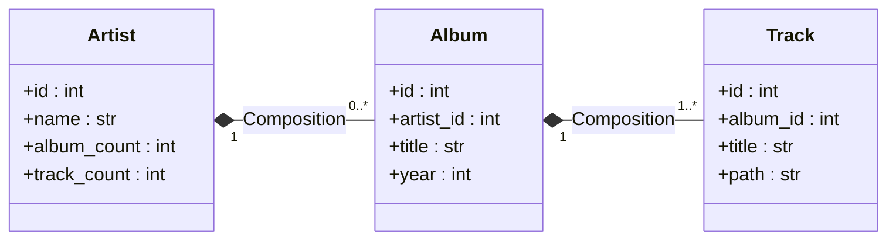

# System Architecture & Database Design

This document covers the structural components of Mai-An Lab and the optimizations that allow it to handle large music libraries on Android.

## Component Overview

| Component | Role |
|-----------|------|
| [StreamripApp](../StreamripApp) | UI, download queue, library indexer, search, playlist engine. |
| [db_manager.py](../StreamripApp/utils/db_manager.py) | SQLite + FTS5 layer: schema, triggers, async transactions. |
| [audio_engine.py](../StreamripApp/utils/audio_engine.py) | Android player state and queue management; ExoPlayer integration. |
| [audio_engine_macos.py](../StreamripApp/utils/audio_engine_macos.py) | macOS player state and queue management; native AVFoundation integration. |
| [flet_audio_service](../flet_audio_service) | Python ↔ Dart ↔ Kotlin bridge for system-level media controls on Android. |

---

## Database & Search Performance

The catalogue lives in a single SQLite file managed by `DatabaseManager`.

### Storage Strategy
- **Async concurrency**; `aiosqlite` with a shared connection and WAL mode.
- **Android-tuned cache**; 64 MB page cache to keep hot metadata off slow Android storage.
- **FTS5 search**; diacritic-folding prefix matches via `unicode61`. Prefix queries stay snappy as the catalogue grows.
- **Smart Triggers**; a suite of SQL triggers keeps aggregate counts (per-artist track/album counts) in sync on every mutation.
- **Single-Query Junction Optimization**; playlist track counts and metadata are fetched in a single pre-joined SQL query using a `LEFT JOIN` and `GROUP BY` clause. This eliminates sequential nested query lookups on the SQLite file, avoiding thread stalls and reducing CPU loading spikes from erratic peaks to a completely flat, fluid baseline.

## Database Schema

The data layer is optimized for fast hierarchical browsing and prefix-based search.

### Core Tables

| Table | Description | Key Fields |
|-------|-------------|------------|
| `artists` | Stores unique artist names and aggregate counts. | `id`, `name`, `album_count`, `track_count` |
| `albums` | Maps artists to their respective releases. | `id`, `artist_id`, `title`, `year`, `genre`, `track_count` |
| `tracks` | The primary music index. | `id`, `album_id`, `title`, `track_num`, `duration`, `path`, `format`, `added_date`, `bitrate`, `bpm`, `energy`, `brightness` |
| `playlists` | User-defined and imported collections. | `id`, `name`, `created`, `color` |
| `playlist_tracks` | Junction table for playlist membership. | `playlist_id`, `track_path`, `order_index` |
| `play_counts` | Extended sound profile, feature space, and play history. | `track_path`, `count`, `last_played`, `bpm`, `energy`, `brightness`, `rolloff`, `beat_strength`, `spectral_flatness`, `spectral_contrast`, `key_index`, `timbre` (52D BLOB), `features_version` |
| `track_neighbors` | Sparse adjacency table representing the $k$-NN acoustic/metadata graph. | `track_path`, `neighbor_path`, `weight`, `edge_kind` |

> [!NOTE]
> **Sound Profile BLOB Layout (v3)**; The high-dimensional feature profile is packed as a single 52-float, little-endian binary BLOB inside the `play_counts.timbre` column (208 bytes total) to keep database size minimal and query speeds fast. The BLOB contains the 20D MFCC Mean, 20D MFCC First-Order Derivative (Delta Mean), and 12D Chroma Pitch Profile. A `features_version` column acts as a schema version, letting the engine dynamically invalidate and re-analyze features if extraction logic evolves.

### Database Structure & Design: Composition vs. Inheritance

While the catalog schema draws high-level structural inspiration from hierarchical data representation models in bioinformatics (e.g. mapping parents to nested features), it is implemented as a highly optimized, precise relational system.

#### 1. Composition over Inheritance
In database modeling, attempting to represent entities via inheritance (e.g. subclassing) leads to complex table structures and sparse tables containing many NULL columns. 

Instead, this schema strictly implements **Composition** (*Part-Of* relationships):
* An `Artist` **composes** multiple `Albums` (`1` to `many` relationship).
* An `Album` **composes** multiple `Tracks` (`1` to `many` relationship).
* All parent-child relationships are strictly bound via foreign keys (`artist_id` in `albums`, `album_id` in `tracks`) using strong constraints (`ON DELETE CASCADE`). Deleting an artist immediately cascades down to delete its albums and tracks, ensuring that no orphan tracks remain to corrupt the database index.



#### 2. Trigger-Based Aggregate Counters (Pre-Computed Denormalization)
Rather than executing expensive nested `SELECT COUNT` joins at runtime when the user navigates the library, the catalog uses pre-computed aggregate columns (`artists.album_count`, `artists.track_count`, and `albums.track_count`).

These fields are kept in sync by database triggers (`trg_tracks_insert_counts`, `trg_tracks_delete_counts`, etc.) on every insert, delete, or update. This guarantees $O(1)$ read latency during scroll and navigation updates.

### Search & Indexing (FTS5)
- **`fts_search`**; a virtual table using the FTS5 module. It indexes `title`, `album`, and `artist` from the tracks table.
- **`unicode61` Tokenizer**; configured with `remove_diacritics=1` to ensure searching "Daft" also matches "Däft".
- **Automatic Sync**; SQL triggers (e.g., `trg_tracks_insert_counts`) automatically propagate changes from the `tracks` table to the FTS index, ensuring search results are never stale.

---

## Platform Performance Tuning & Architectural Dual-Support

To achieve a stable 60 FPS UI across platforms while running a full CPython backend, the architecture deploys tailored optimizations for each host operating system:

### Android-Specific Optimizations
- **Targeted UI Refreshes**; the app bypasses Flet's global `page.update()` for the high-frequency playback heartbeat. By refreshing only the specific player controls, we reduce background CPU spikes by ~60%.
- **Throttled Position Heartbeat**; playback position mirroring is strictly throttled to **1.5s** intervals. This minimizes Python/Dart bridge chatter and preserves battery life.
- **Zero-Cost Indicators**; heavy Python-driven animation loops were replaced with static or GPU-accelerated native indicators, keeping the background CPU baseline to a minimum.
- **Active UI Containment**; to prevent memory bloat or WebSocket choking under long sessions, high-volume control arrays (like the Jarvis chat history bubble tree) are strictly capped at **50** active items, dynamically popping older nodes.
- **High-Performance Carousel Slide-In Pagination**; rather than appending thousands of result cards in a massive flat list that bloats Flet's control tree and chokes the mobile memory buffer, both LibraryView and SearchView render only **one active page at a time** (typically **35** items per page). Swapping pages teleports the scroll offset off-screen instantly and triggers a highly optimized, snappy, hardware-accelerated **Slide-In and Fade Offset Animation** (tuned to **100ms** with a **80ms** sleep redraw interval), keeping the widget tree tiny and UI rendering at a rock-solid 60 FPS.
  - *Gesture-Safe Navigation*: Swipe-to-turn gestures are removed to prevent erratic, accidental page jumps during normal touch-scrolling. Page transitions are driven reliably via explicit pagination chevrons and fully clickable boundary ghost cards at the limits of the scroll view.
- **Background Search Inactivity Lifecycle (Battery Saver)**; remote search operations rely on an asynchronous worker loop running on a background daemon thread. To eliminate silent battery drain and memory overhead while the app is in the background or active on other tabs, the thread, loop, and Qobuz client session are completely torn down and closed after **5 minutes** of inactivity, and seamlessly recreated on-demand when a new query is executed.

### macOS-Specific Optimizations
- **Direct-In-Process Native Execution**; rather than using heavy inter-process MethodChannels or launching external players, macOS utilizes `pyobjc-framework-AVFoundation` to play audio within the same CPython process. This keeps memory and startup overhead extremely low.
- **Lock-Synchronized CoreAudio Pipeline**; a dedicated reentrant thread lock (`threading.RLock`) surrounds all queue mutations, state changes, playback commands, and observer updates. This guarantees absolute thread-safety when async events (like user interface controls) collide with high-frequency background playback heartbeats.
- **Decoupled Position Updates & UI Throttle**; the high-precision internal position state (`self.position`) is updated instantly at 10 Hz from a custom background polling thread to guarantee precise track resumption and seamless seeking. However, Flet's layout notification pipeline (`self.dispatch`) is throttled to 5 Hz (once every `0.20s`), eliminating UI thread layout congestion while maintaining visual responsiveness.
- **Automated Subprocess Isolation**; by completely bypassing shell wrappers or command-line subprocess decoders for music playback, the macOS client eliminates the risk of resource leaks, defunct threads, or system-wide zombie processes.


## Artwork Caching & Temporary Storage

To minimize disk I/O and prevent UI lag during list scrolling, the app utilizes a multi-tiered artwork caching system.

### In-Memory LRU Cache
A Python-level **Least Recently Used (LRU)** cache (`_ARTWORK_CACHE`) stores up to **50** cached artwork paths.
- **Fast Path**; if a track or album is displayed and its artwork is in the cache, the path is returned instantly without checking the disk or re-extracting from the audio file.

### Persistent Temporary Storage
Extracted artwork and downloaded images are stored in a `temp` directory within the app's internal storage.
- **Isolation**; these files are excluded from Android's Media Store to prevent them from appearing in the user's Gallery app.
- **Cleanup**; temporary artwork is pruned on app shutdown or when the LRU cache evicts a path, ensuring the app's storage footprint remains lean.

---

## Metadata Curation & Deletion Internals

Mai-An Lab supports direct in-app library modification, writing changes directly to physical files and executing database cascade routines under atomic async contexts:

### 1. Metadata Curation Pipeline
- **Physical Tag Mutations**: When editing a track’s metadata tags, the Python backend locks the physical file and executes header writes using low-level container bindings (e.g. Vorbis comments for `.flac`, ID3 tags for `.mp3`, and MP4 tags for `.m4a`).
- **Database Synchronization**: Following disk write completion, the app launches an asynchronous SQLite transaction. It updates the target `tracks`, `albums`, or `artists` tables while keeping WAL journaling active.
- **Aggregate Recalculation Triggers**: SQL triggers automatically run on the updated track rows, recalculating aggregate stats (like artist track counts and album releases) in real-time to keep the expanded UI listings perfectly synchronized.

### 2. Physical Song Deletion Pipeline
Song deletion executes in a strict two-phase atomic pipeline to ensure file-system and database consistency:
- **Phase 1: Physical Erasure**: The target file path is passed to an asynchronous worker thread, which uses `os.remove` to erase the file permanently from internal or external storage.
- **Phase 2: Database Cascade & Cleansing**: The track row is deleted from the `tracks` database table. A comprehensive cascade structure automatically triggers:
  * **Junction Cleanup**: Removes occurrences of the deleted track path from the `playlist_tracks` junction table.
  * **FTS5 De-indexing**: Wipes search tokens associated with the deleted track from the `fts_search` virtual table.
  * **Aggregate Updates**: Mutates artist track/album counts. If an artist or album now contains **zero** tracks, their parent rows are automatically deleted from `artists` and `albums` respectively, keeping the library tree clean.

---

## Download Auto-Rescanning Pipeline

To bridge remote search and the local playback library seamlessly, downloads automatically trigger non-blocking recursive indexers:

```text
Qobuz Download ──► Background Worker ──► Atomic Rename (.tmp → .flac)
                                                   │
                                                   ▼
                                         LibraryScanner Callback
                                                   │
                                                   ▼
                                       Targeted Indexing Scan
                                                   │
                                                   ▼
                                        SQLite DB WAL Ingestion
                                                   │
                                                   ▼
                                         Live UI Accent Refreshes
```

- **Non-Blocking Execution**: Remote downloads run on dedicated worker threads. When a download completes and passes checksum validation, it is renamed atomically from a `.tmp` file to its target format.
- **LibraryScanner Callback**: The downloader thread immediately fires an asynchronous callback that calls `LibraryScanner.scan_track` on the specific downloaded file path.
- **Instant Local Integration**: Instead of rebuilding the entire music database, the scanner performs a highly optimized, single-file SQLite WAL ingestion. It extracts metadata tags, writes the track details to `tracks` (triggering aggregate counters), and refreshes the Library tree dynamically.
- **Zero-Refresh User Experience**: The newly downloaded song appears in the **Library** tab within milliseconds of the search-card download completing. The UI replaces the download button with a **cyan check icon** automatically, enabling immediate playback without manual scanning.
