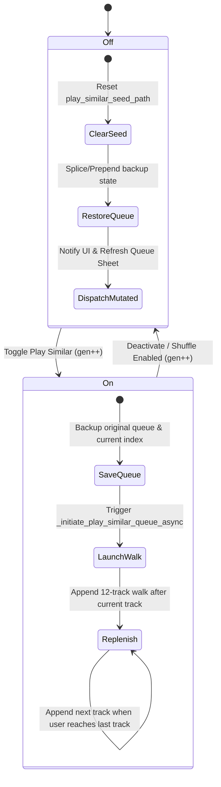

# Auto-Playlist Engine: $k$-NN Similarity Graph & Walkers

> [!NOTE]
> **Production Status**; The music recommendation system has been upgraded from discrete Markov Clustering (MCL) buckets to a continuous, high-performance **$k$-NN Hybrid Similarity Graph**. This provides the fluid, adaptive, and infinite transitions necessary for the voice assistant's playback pipelines.

> [!TIP]
> **Bioinformatics Origins**; This engine was inspired by similarity matrices in bioinformatics (mapping tracks to a multi-dimensional feature space and building a sparse topological network for traversal walks instead of discrete buckets).

---

## The Hybrid Recommendation Pipeline

The engine bridges low-level digital signal processing (DSP) and high-level relational metadata to construct a sparse, dual-tier directed network of similar tracks:

```text
audio file ──► MediaCodec (Android) ──► mono int16 PCM @ 22050 Hz (90s)
                                                   │
                                                   ▼
                                        Pure-Numpy DSP Analyser
                                                   │
        ┌─────────────────────┬────────────────────┼────────────────────┬─────────────────────┐
        ▼                     ▼                    ▼                    ▼                     ▼
  RMS energy (dB)      Spectral centroid    Spectral rolloff   Onset-flux autocorr   Mel-filterbank STFT
                        (brightness)         (85th-pct freq)    + 120-BPM prior              │
                                                                 │                            ▼
                                                                 ▼                  log → DCT-II → MFCC
                                                           BPM + beat strength               │
                                                                                   ┌──────────┼──────────┐
                                                                                   ▼          ▼          ▼
                                                                              MFCC mean  MFCC Δ-mean  chroma
                                                                                 (20)        (20)       (12)
                                                                                                    (52-D Timbre)
                                                   │
                                                   ▼
                       60-D Unified Feature Vector (52-D Timbre + 8 Scalars, v3)
                                                   │
                                                   ▼
                                        Z-Score Column Standardisation
                                                   │
                                                   ▼
                                         L2 Row Normalisation
                                                   │
                                                   ▼
                                  Acoustic Cosine Similarity Graph 
                                      (Top K=20 nearest neighbours)
                                                   │
         Junction Metadata Edges ◄─────────────────┼────────────────► Same-Artist / Album Edges
      (Album sequence / Recent additions)          │                  (Biased distance weighting)
                                                   ▼
                                     HYBRID k-NN ADJACENCY NETWORK
                                                   │
                                                   ▼
                Personalised-PageRank Walker  +  Library-Relative Mood Scorer
                  (restart · softmax τ · MMR ·    (percentile rank · centroid ·
                   multi-tier · persistent avoid)  listen-signal · Camelot)
                                                   │
                                                   ▼
                                    Seamless Dynamic Playback Queue
```

---

## 1. Feature Extraction & Vector Space (v3)

Acoustic vectors are extracted by a pure-NumPy DSP analyzer (no Librosa, no SciPy; works on every host). The analyser is invoked from the laptop-side offload script (see §7); the on-device fallback exists but is no longer the primary path because library-wide DSP on a phone is impractically slow (10+ s/track vs ~200 ms/track on a laptop).

### The 60-Dimensional Feature Space (v3, `FEATURES_VERSION = 3`)

#### Quick reference; what each feature tells you about a track

| Field | Shape | What it captures | What "high" sounds like |
|---|---|---|---|
| `bpm` | scalar | Estimated tempo (60–200) | Drum & bass, techno |
| `energy` | scalar [0,1] | dB-mapped RMS loudness | Loud / dense mix |
| `brightness` | scalar [0,1] | Spectral centroid / Nyquist; "centre of mass" of the spectrum | Bright synth leads, cymbals |
| `rolloff` | scalar [0,1] | Frequency below which 85% of the energy lives | Sharp high-frequency content |
| `beat_strength` | scalar [0,1] | Confidence in the BPM estimate (autocorr peak height) | Steady kick-driven dance |
| `spectral_flatness` | scalar [0,1] | Wiener entropy: tonal (low) ↔ noisy (high) | White noise, distortion |
| `spectral_contrast` | scalar [0,1] | Peak-to-valley dB across sub-bands | Clear melody over quiet floor |
| `key_index` | int 0–23 | 0–11 = C..B major; 12–23 = C..B minor | (categorical; drives harmonic sequencing) |
| `mfcc_mean` | 20 floats | Average **timbre fingerprint**; "what instruments / kind of sound" | (vector; cosine compared track-to-track) |
| `mfcc_delta` | 20 floats | How fast timbre changes frame-to-frame | (vector; captures evolution, not just stasis) |
| `chroma` | 12 floats | Proportion of each pitch class (C, C#, D, …) | (vector; basis for the K-S key estimate) |

The 8 scalars get their own DB columns (cheap WHERE filters and direct mood-profile scoring); the 52-D timbre triple (`mfcc_mean` + `mfcc_delta` + `chroma`) is packed into one `float32` LE BLOB on `play_counts.timbre`. Total: **60 dimensions per track** (52-D timbre + 8 scalars).

#### Component details


1. **52-Dimensional Timbre Profile** (packed as one `float32` LE BLOB on `play_counts.timbre`):
   * **MFCC Mean (20 dimensions)**: Average spectral envelope of the HPSS-harmonic component (cleaner timbre; no kick-drum bleed into the mel cepstrum).
   * **MFCC Δ-Mean (20 dimensions)**: First-order temporal derivative of MFCC, averaged across frames. Captures *how* timbre evolves; strictly more informative than raw standard deviation, which can't tell a smooth drift apart from rapid oscillation between two stable timbres.
   * **Chroma Pitch Profile (12 dimensions)**: Pitch-class profile of the HPSS-harmonic component; the basis for both the harmonic-similarity score and the Krumhansl–Schmuckler key estimate.

2. **8-Dimensional Scalar Descriptors** (their own columns on `play_counts`):
   * **BPM**: Onset-flux autocorrelation on the HPSS-percussive component, with a log-Gaussian prior centred on 120 BPM to suppress octave doublings.
   * **Beat Strength**: Autocorrelation height at the chosen tempo lag; serves as a confidence/regularity score in `[0, 1]`.
   * **Energy (RMS)**: dB-mapped loudness in `[0, 1]`.
   * **Brightness (Spectral Centroid)**: Normalised by Nyquist to `[0, 1]`.
   * **Spectral Rolloff**: 85th-percentile cutoff frequency, normalised to `[0, 1]`.
   * **Spectral Flatness** (Wiener entropy): Per-frame geometric/arithmetic-mean ratio, averaged. Tonal content sits near 0, white noise approaches 1; metal/distorted rock pushes high while sparse acoustic stays low.
   * **Spectral Contrast**: Mean peak-to-valley dB difference across six frequency sub-bands, normalised to `[0, 1]`. Complements flatness; clear tonal peaks above a low noise floor produce high contrast, noisy textures produce low contrast.
   * **Key Index** (0–23): Krumhansl–Schmuckler key estimate; 0–11 = C through B major, 12–23 = C through B minor. Drives future "play in the same key" / "play minor-mode tracks" intents.

### Harmonic-Percussive Source Separation (HPSS)
Before MFCC, chroma and onset detection run, the magnitude spectrogram is split into harmonic and percussive components via median filtering (Fitzgerald 2010):
* A time-axis median filter (kernel ≈ 400 ms) reveals sustained harmonic content; a frequency-axis median filter (kernel ≈ 180 Hz) reveals broadband percussive transients.
* A soft Wiener-style mask combines the two filtered spectrograms into `H` and `P`.
* **MFCC + chroma** run on `H` only; much cleaner timbre and pitch estimates because kick-drum transients no longer bleed into the mel cepstrum or the chroma pitch buckets.
* **Onset detection** runs on `P` only; substantially better BPM estimates on slow, sparse or syncopated tracks where the unseparated spectrum used to confuse the autocorrelation.

Implementation is in `StreamripApp/utils/dsp.py` (`_hpss`, `_median_filter_axis`). Pure NumPy; `scipy.signal.medfilt2d` is deliberately avoided so the analyser has zero native dependencies.

---

## 2. Graph Construction Mechanics

The backend [DatabaseManager](file:///Users/chrismitsacopoulos/Desktop/Mai-An-Lab/StreamripApp/utils/db_manager.py) and [track_graph.py](file:///Users/chrismitsacopoulos/Desktop/Mai-An-Lab/StreamripApp/utils/track_graph.py) build a sparse $k$-NN database table (`track_neighbors`) split into two distinct tiers.

### A. The Acoustic Similarity Tier (`edge_kind = 'acoustic'`)
To build the acoustic similarity tier, the engine loads every track that has a current-version feature BLOB and concatenates the 52-D timbre vector with all 8 scalar descriptors (`bpm`, `brightness`, `energy`, `rolloff`, `beat_strength`, `spectral_flatness`, `spectral_contrast`, `key_mode`) into a **60-D row vector** per track.

* **Standardisation (Z-Scoring)**; putting every feature on a common ruler. BPM lives in 60–200, MFCCs sit in roughly ±20, energy is in [0, 1]. Without scaling, BPM alone would dominate any Euclidean or cosine comparison simply because its raw magnitudes are an order of magnitude larger. Z-scoring centres each column on mean 0 and scales it to unit standard deviation:
  $$Z_{ij} = \frac{X_{ij} - \mu_j}{\sigma_j}$$
  After this transform every feature contributes proportionally to its *spread across the library*, not its absolute magnitude. A 5 BPM gap now counts the same as a 5-σ shift in MFCC coefficient 0.

* **Row Normalisation**; turning dot products into cosines. The standardised vectors are L2-normalised:
  $$\hat{Z}_i = \frac{Z_i}{\|Z_i\|_2}$$
  Once every row has unit length, the dot product $\hat{Z}_i \cdot \hat{Z}_j$ is exactly $\cos\theta$ between the two vectors; a number in $[-1, 1]$ where 1 means "same direction in feature space" (musically very similar) and 0 means "perpendicular" (unrelated). The full pairwise matrix is just $\hat{Z}\hat{Z}^T$, computable in 256-row blocks to avoid materialising an N×N matrix on big libraries.

* **Top-K Selection ($K=20$)**: To keep database storage efficient, only the top-20 nearest neighbours per track are retained. `np.argpartition` finds them in $O(N)$ per row (no full sort needed); the final ordering for storage is recovered with a $O(K \log K)$ sort over the K-slice.

* **Mutual-kNN Pruning**; fighting popularity bias. After Top-K selection, the engine retains an edge $(i \to j)$ **iff $j$ is in $i$'s top-K AND $i$ is in $j$'s top-K**:
  $$E_{\text{mutual}} = \{(i,j) : j \in \text{topK}(i) \;\land\; i \in \text{topK}(j)\}$$
  Why bother? Consider a cluster-centroid track; say a generic acoustic-guitar track. It's geometrically close to many other tracks, so it appears in *everyone's* top-K. But its *own* top-K all points into the same dense cluster. Without mutual-kNN, the random walker piles up on that centroid (everyone points to it; it points back into a tight cluster; rinse, repeat). Mutual-kNN intersects the two sets and keeps only the symmetric edges, flattening the over-representation without removing the geometric signal. Tracks with fewer than 5 mutual partners fall back to their original top-K so the graph stays connected (the threshold is for connectivity, not strict mutuality).

### B. The Metadata Co-Occurrence Tier
When acoustic data is missing or needs to be augmented, the engine falls back to relational metadata connections:
* **Same-Album Edges (`edge_kind = 'album'`)**: Connects all tracks belonging to the same album. The weight scales inversely with their track distance in the tracklist to preserve natural listening transitions:
  $$w = \frac{1.0}{1.0 + 0.1 \times (\text{distance} - 1)}$$
* **Same-Artist Edges (`edge_kind = 'artist'`)**: Links tracks from the same artist (capped at $K=30$ per track to prevent prolific artists from flooding the table), sorted and biased toward newer releases (`added_date DESC`).

---

## 3. Stateful Graph Traversal (Personalised-PageRank Walker)

The voice assistant runs a **personalised-PageRank-flavoured random walk** with six behavioural levers: anchoring (restart), exploration (softmax temperature), diversity (MMR), tier-aware pooling, taste-model re-ranking, and negative-centroid avoidance. When a user says *"play more like this"*, the walker traverses the graph from the current track's seed.

Each step does three things: **gather candidates → score them → sample one**. The subsections below cover each of these in turn.

### 3.1 Gather; multi-tier candidate pooling

Each step pools acoustic + artist neighbours into one candidate set, then attaches a per-tier multiplier before any scoring math happens:

$$\text{effective\_weight}(c) = \text{raw\_weight}(c) \times \mu_{\text{tier}(c)}$$

with $\mu_{\text{acoustic}} = 1.0$, $\mu_{\text{artist}} = 0.4$, $\mu_{\text{album}} = 0.2$. An acoustic neighbour at cosine 0.9 has effective weight 0.9; an artist neighbour at raw weight 1.0 has effective weight 0.4. The walker therefore prefers acoustic edges by default but artist edges catch it when acoustic edges are absent; including mid-walk, not just at the seed.

When the same track appears in two tiers (e.g. an acoustic neighbour that's also same-artist), the merge keeps the **maximum effective weight** so the stronger signal wins and the candidate appears exactly once in the pool.

### 3.2 Score; composite logit with four additive terms

The per-candidate logit is a composite of four additive terms computed before the softmax:

$$\text{logit}_c = \underbrace{w_c \cdot \mu_{\text{tier}}}_\text{effective edge weight} - \underbrace{\lambda_{\text{MMR}} \cdot \max_{v \in \text{visited}} \cos(e_c, e_v)}_\text{diversity penalty} - \underbrace{\lambda_{\text{neg}} \cdot \max_{r \in \text{rejected}} \cos(e_c, e_r)}_\text{negative-centroid penalty} + \underbrace{\gamma \cdot (P(\text{like} | \mathbf{x}_c) - 0.5)}_\text{taste re-rank}$$

| Term | Default | Purpose |
|---|---|---|
| $\lambda_{\text{MMR}}$ | 0.3 | Penalises candidates close in timbre to already-visited nodes |
| $\lambda_{\text{neg}}$ | 0.6 | Penalises candidates close in timbre to session-rejected tracks (skips/dislikes) |
| $\gamma$ | 0.00 | Taste-model nudge; set to 0.0 for Play Similar to focus purely on acoustic similarity |

> [!NOTE]
> While the traversal algorithm supports taste-model re-ranking ($\gamma = 0.15$), it is disabled ($\gamma = 0.0$) by default for **Play Similar** and **Jarvis continuous walks** to keep playback strictly aligned with acoustic properties and avoid genre drift. The taste model regressor is instead utilized to personalize automatic mood partitions in the **Moods Pane**.

### 3.3 Score; Long-Flow / Gentle-Reset softmax temperature

The softmax converts logits to probabilities:

$$p_i = \frac{e^{\text{logit}_i / \tau_{\text{step}}}}{\sum_j e^{\text{logit}_j / \tau_{\text{step}}}}$$

The baseline temperature is $\tau = 0.08$, but the effective per-step temperature follows a **Long-Flow / Gentle-Reset** schedule:

| Step type | Formula | Effective $\tau$ | Behaviour |
|---|---|---|---|
| Normal (steps 1–5, 7–11, …) | $\tau_{\text{step}} = \tau \times 0.75$ | 0.06 | Near-greedy: the walk stays tightly in the acoustic neighbourhood |
| Reset (every 6th step) | $\tau_{\text{step}} = \tau \times 1.5$ | 0.12 | Gentle exploration: compatible novelty injected without jarring leaps |

This prevents local-minimum traps — e.g. a slow acoustic metal ballad's low-energy features mapping it near dark trap beats would cause a near-greedy walker to get permanently stuck.

For numerical stability the code subtracts $\max_j \text{logit}_j$ before exponentiating; the resulting probabilities are mathematically identical because softmax is shift-invariant.

The **MMR diversity penalty** (Maximal Marginal Relevance) is the first subtractive term in the composite logit. For each candidate $c$ we compute its maximum cosine to anything already in the walk:

$$\text{logit}_c \mathrel{-}= \lambda \cdot \max_{v \in \text{visited}} \cos(\text{timbre}_c, \text{timbre}_v)$$

with $\lambda = 0.3$ by default. Intuitively: if candidate $c$ sounds very similar to a track we already added, subtract $\lambda \times$ that similarity from its logit. The walker still prefers candidates similar to the *seed* (high raw cosine via the edge) but inside that pool it now prefers candidates that are *different from each other*. The trade-off is a small sliver of seed-similarity for noticeably more variety across repeated *play similar* calls from the same seed.

### 3.4 Sample; Personalised-PageRank restart

Before sampling from the softmax, with probability $\alpha = 0.15$, the walker **teleports back to the teleport target** instead of stepping forward from `current`. The teleport target defaults to the seed but can be overridden (e.g. to anchor back to the original seed when Play Similar mode dynamically appends tracks from the current playing position). This is the *personalised PageRank* trick; the random surfer occasionally jumps to a preferred page rather than following an outlink. The stationary distribution is:

$$P_{\text{stationary}}(v) = \alpha \cdot \mathbb{1}[v = \text{teleport}] + (1-\alpha) \sum_u P(u) \cdot \text{transition}(u, v)$$

That $\alpha$ fraction is the **anchor**. Without it, the walker's distance from the seed grows roughly linearly with step count and you end up far afield; a "play similar" sequence ten steps in would have basically forgotten the seed. With it, the walker effectively averages over "where do I get to in $1/\alpha \approx 6.6$ steps before being yanked back?"; and the resulting playlist concentrates around the seed's true neighbourhood regardless of length.

### 3.5 Persistent avoidance and batched prefetch

* **Persistent avoidance set**: the `avoid` set passed into `walk()` unions the assistant's in-memory recent list with the on-disk `playback_history` table (7-day window). Tracks the user heard yesterday don't reappear today, even across app restarts. See §4.3 for the table schema.

* **Batched 2-hop prefetch**: `walk()` issues **one** query at the start that materialises the seed's 1-hop neighbours and then the 1-hop neighbours of every 1-hop neighbour (the 2-hop horizon). The walker then steps entirely in memory through that subgraph. Length-12 walks cost one DB round-trip plus the small fan-out queries, instead of twelve sequential awaits.

### 3.6 The walker in pseudocode

```text
fn walk(seed, length, kinds, weights, α, λ_mmr, λ_neg, τ, γ, ε, avoid, teleport):
    horizon       = prefetch_two_hop(seed, kinds)     # one SQL round-trip
    visited       = avoid ∪ {seed}
    visited_embs  = [embedding(seed)] if available else []
    neg_embs      = [embedding(r) for r in session_rejected]
    taste_w, taste_b = load_taste_model()             # cold → skip re-rank
    current       = seed
    output        = []

    repeat length times:
        step = len(output)

        # 3.4: anchor (Personalised-PageRank teleport)
        if uniform() < α:
            current = teleport

        # 3.1: gather
        candidates = horizon[current]
        candidates = merge_tiers(candidates, weights, exclude=visited)
        if candidates is empty:
            if current ≠ teleport: current = teleport; continue
            else: break

        # 3.2: composite logit
        logits = [c.effective_weight for c in candidates]
        if λ_mmr > 0 and visited_embs:
            for i, c in enumerate(candidates):
                logits[i] -= λ_mmr * max(cos(emb(c), v) for v in visited_embs)
        if λ_neg > 0 and neg_embs:
            for i, c in enumerate(candidates):
                logits[i] -= λ_neg * max(cos(emb(c), r) for r in neg_embs)
        if taste_w is not None and uniform() >= ε:     # exploration toggle
            for i, c in enumerate(candidates):
                logits[i] += γ * (σ(taste_w · pc(c) + taste_b) − 0.5)

        # 3.3: Long-Flow / Gentle-Reset temperature
        if (step + 1) % 6 == 0:
            τ_step = τ × 1.5                           # gentle reset
        else:
            τ_step = τ × 0.75                          # cohesive flow

        probs  = softmax(logits / τ_step)
        chosen = sample(candidates, probs)

        output.append(chosen)
        visited.add(chosen)
        if embedding(chosen) exists:
            visited_embs.append(embedding(chosen))
        current = chosen

    return output
```

The reference implementation is in [track_graph.walk()](file:///Users/chrismitsacopoulos/Desktop/Mai-An-Lab/StreamripApp/utils/track_graph.py#L468); the function signature exposes every knob (`restart_prob`, `diversity_lambda`, `negative_lambda`, `temperature`, `taste_weight`, `taste_explore`, `edge_kind_weights`, `teleport_path`, …) so different intents can re-tune the walker without touching the algorithm. A hypothetical *play discovery* intent would use $\tau = 0.2$, $\alpha = 0.05$, $\lambda = 0.5$; same code path, different point in the trade-off space.

---

## 4. Automatic Preset Moods & Library-Relative Profiles

Vocal commands like *"play something chill"* or *"play happy tracks"* utilize a dynamic, library-relative scoring algorithm using automatic preset mood profiles. The canonical vocabulary lives in a single `MOODS` table; `MOOD_PROFILES` and `MOOD_KEYWORDS` are derived views kept for backwards compatibility (do not edit them directly).

```python
@dataclass(frozen=True)
class MoodSpec:
    canonical: str
    profile: dict[str, float]                 # target percentile per feature
    aliases: tuple[str, ...] = ()
    camelot_pref: str | None = None           # "major" / "minor" / None
    bpm_smooth_weight: float = 1.0            # tempo-jump penalty multiplier
    centroid: tuple[float, ...] = ()          # optional dense timbre centroid

MOODS = {
    "chill":  MoodSpec("chill",  {"bpm": 0.20, "energy": 0.20, "brightness": 0.30, "beat_strength": 0.30},
                       aliases=("chilled",), camelot_pref="minor", bpm_smooth_weight=1.5),
    "happy":  MoodSpec("happy",  {"bpm": 0.70, "brightness": 0.85, "energy": 0.70},
                       camelot_pref="major"),
    "tonal":  MoodSpec("tonal",  {"spectral_flatness": 0.10, "spectral_contrast": 0.90}),
    # ...
}
```

### 4.1 Percentile ranks; library-relative scoring math

The naïve way to ask "find me energetic tracks" is to threshold on absolute energy. But "energetic" in an ambient library lives at a totally different absolute energy than "energetic" in a metal library. So the scorer doesn't use absolute values; it uses **percentile ranks**.

For each scalar feature column, every track is ranked from slowest/quietest/darkest to fastest/loudest/brightest, and the rank is divided by $N-1$:

$$p_{i,f} = \frac{\text{rank}(x_{i,f})}{N - 1} \in [0, 1]$$

Track at rank 0 → percentile 0.0; track at rank $N-1$ → percentile 1.0. Implementation is the two-argsort trick: `np.argsort(np.argsort(col))` returns the inverse permutation, which *is* the rank of each element; no for-loop required.

Each `MoodSpec.profile` declares targets in this same percentile space:

```python
"chill":  {"bpm": 0.20, "energy": 0.20, "brightness": 0.30, "beat_strength": 0.30}
"intense":{"energy": 0.95, "beat_strength": 0.90, "brightness": 0.75}
```

A chill profile literally says *"give me a track in the bottom 20% of BPM and energy of THIS library, and the bottom 30% of brightness and beat strength"*. Plug a metal library in and "chill" still picks the calmest 20%; plug an ambient library in and it picks the calmest 20% of *that*; exactly the right relativity.

The **scalar score** is the negative Euclidean distance from the track's percentile vector to the target, restricted to features the spec actually cares about (missing keys mean "don't care, drop from the masked diff"):

$$\text{scalar\_score}_i = -\sqrt{\sum_{f \in \text{profile}} \big(p_{i,f} - t_f\big)^2}$$

Higher (closer to 0) is better. The cache key `(features_version, row_count, max_path)` is a cheap library-change proxy; when a new track is analysed, the row set changes and so does the lexicographic max path, invalidating the cache. Mood queries that hit the cache pay only a dict lookup.

### 4.2 Custom-mood centroids and the convex combination

A custom mood; stored in `custom_moods.json`; is seeded by a single exemplar track. The 52-dimensional timbre vector of that exemplar track acts as the **centroid** ($C = T_{\text{exemplar}}$). For a track to match a custom mood, the scorer computes the cosine similarity between its timbre BLOB and the centroid:

$$\text{centroid\_score}_i = \cos(\text{timbre}_i, \text{centroid}) = \frac{\text{timbre}_i \cdot \text{centroid}}{\|\text{timbre}_i\| \cdot \|\text{centroid}\|}$$

Built-in moods score on percentile-Euclidean (4.1); custom moods score on this cosine. To unify, when a mood has **both** a profile AND a centroid, the scorer blends them:

$$\text{mood\_score}_i = \alpha \cdot \text{scalar\_score}_i + (1 - \alpha) \cdot \text{centroid\_score}_i$$

with $\alpha = 0.5$ (`_MOOD_ALPHA_SCALAR`). Built-in moods today have profile only; scalar score wins; custom moods (Custom tab) today have centroid only; cosine wins. The unified scorer means there are no two code paths to keep in sync; adding a `profile` to a custom mood (or a `centroid` to a built-in) automatically blends both signals without any new branching.

### 4.3 Listener-feedback re-rank; the β-mix

The `mood_score` from §4.1+4.2 is then perturbed by the **listen signal**: a per-track number in roughly $[-1, 1]$ derived from `playback_history`:

$$\text{signal}_i = \frac{\text{completed}_i - \text{skipped\_early}_i}{\max(\text{plays}_i, 5)}$$

The denominator floor at 5 is doing real work here. It prevents a single early skip on a brand-new track from yanking the signal all the way to $-1$; a track has to be played 5+ times before the signal can hit the extremes. This makes the system **conservative**: new tracks get a fair shot, and habitually-skipped tracks accumulate a meaningful negative signal only after the pattern is real.

The signal mixes into the mood score with a small weight $\beta = 0.2$ (`_MOOD_BETA_LISTEN`):

$$\text{final\_score}_i = (1 - \beta) \cdot \text{mood\_score}_i + \beta \cdot \text{signal}_i$$

Two design constraints make this safe:

1. **Re-rank only the top window**. The mix runs on the top $3 \times \text{limit}$ candidates only (`rerank_window = max(limit*3, 12)`). A strongly-disliked track on the long tail can't be promoted by some random noise; it has to be *almost mood-relevant* before feedback can move it.
2. **Tracks with no history contribute zero**. `listen_signal_map()` returns `{}` for tracks that have never been played, and `final_score` falls back to the raw mood score for those. Fresh libraries behave like the no-history baseline.

### 4.4 The Playback-History Feedback Loop

A new SQLite table `playback_history(track_path, played_at, event, seed_path)` records every track the assistant queues, with `event ∈ {played, skipped_early, completed}`. The table drives two consumers:

* **Persistent avoidance set** for the random walker (§3.4); unioned with the in-memory recent list (7-day window). The walker no longer re-recommends a track you heard yesterday.
* **Listen-signal re-rank** for mood scoring (§4.3); see the formula above.

`seed_path` is set when the track was reached via *play similar* so we can later attribute skips/completions back to the seed for online edge tuning, if we ever want it.

Both consumers degrade gracefully if the table is empty (fresh install); `recent_played_paths()` returns an empty set and `listen_signal_map()` returns `{}`, so the walker and mood scorer behave like the pre-history baseline.

* **Why it's library-relative**: A "fast" or "intense" track in a library of ambient is slower than a "fast" track in a library of drum & bass. Percentile ranking against the active database distribution ensures mood recommendations adapt to the user's specific collection; there is no global threshold to maintain.

### 4.5 Custom Moods (Islets) and Custom Centroids

Custom moods (originally named Acoustic Islets) represent dynamic, localized topological clusters in the unit-normalised 52-dimensional timbre space ($\mathbb{R}^{52}$). Rather than relying on rigid, pre-computed playlist classes; the mood system dynamically generates custom centroids and identifies cohesive groups of contiguous tracks.

#### A. Centroid Computation Mathematics

A custom centroid $C \in \mathbb{R}^{52}$ is defined directly as the unit-normalised 52-dimensional timbre vector ($T_{\text{exemplar}}$) of the single exemplar seed track selected by the user:

$$C = T_{\text{exemplar}}$$

The timbre vector $T_{\text{exemplar}}$ is a concatenation of the harmonic-isolated MFCC mean (20-D), harmonic-isolated MFCC delta mean (20-D), and harmonic-isolated chroma pitch profile (12-D).

#### B. Dynamic Custom Mood Membership Evaluation

A track $i$ with timbre vector $T_i$ is admitted as a member of the custom mood if its cosine similarity to the centroid $C$ meets or exceeds a designated threshold $\theta_{\text{custom}}$:

$$\text{similarity}_i = \cos(T_i, C) = \frac{T_i \cdot C}{\|T_i\|_2 \|C\|_2} \ge \theta_{\text{custom}}$$

* **Base Threshold**: The default threshold is set at $\theta_{\text{custom}} = 0.93$, capturing exceptionally tight acoustic coherence.
* **Dynamic Decay**: If candidate density is sparse, $\theta_{\text{custom}}$ dynamically decays down to a lower bound of $0.85$ to ensure coverage.
* **Generalizability Guard (`ISLET_MIN = 3`)**: To prevent degenerate, isolated outlier tracks from acting as spurious micro-clusters, a custom mood must contain a minimum of three tracks. If $|I| < 3$, where $I$ is the set of matching candidates, the custom mood is discarded and returns an empty list.
* **Density Capping (`ISLET_MAX = 50`)**: To preserve high-dimensional specificity and prevent massive, high-density music regions from diluting the playlist tone; custom mood membership is capped at a maximum of 50 tracks.

#### C. The Unified Hybrid Scoring Equation

For hybrid moods that define both a target scalar percentile profile and a custom mood centroid, the engine computes a unified score via a convex combination:

$$\text{mood\_score}_i = \alpha \cdot \text{scalar\_score}_i + (1 - \alpha) \cdot \text{centroid\_score}_i$$

where $\alpha = 0.50$ represents the default balance parameter (`_MOOD_ALPHA_SCALAR`). The `scalar_score` provides the library-relative percentile-Euclidean distance, and the `centroid_score` provides the raw high-dimensional cosine similarity.

### 4.6 Smart Online Learning (Dynamic Mood Profile Adaptation)

To allow the library's preset and custom moods to dynamically morph and adapt to the listener's tastes over time, the system features a robust **Smart Online Learning** algorithm driven by active track feedback (Likes/Dislikes) in the Default moods view.

#### A. The Profile Tuning Learning Rule
When a user provides positive or negative feedback on a track $i$ under mood $M$, the system performs a gradient shift on the mood's target DSP percentiles ($T_f$). 
Let $P_{i, f} \in [0, 1]$ be the library-relative percentile rank of track $i$ for scalar feature $f$. The target percentile $T_f$ is shifted using a learning rate parameter $\eta = 0.15$:

- **On Like (Positive Reinforcement)**:
  $$T_f \leftarrow T_f + \eta \cdot (P_{i, f} - T_f)$$
  This pulls the mood's target profile *closer* to the liked track's features, expanding the mood's boundaries to naturally pull similar tracks in.
  
- **On Dislike (Negative Reinforcement)**:
  $$T_f \leftarrow T_f - \eta \cdot (P_{i, f} - T_f)$$
  This pushes the mood's target profile *away* from the disliked track's features, narrowing the boundaries to repel similar tracks.

After shifting, the updated target $T_f$ is strictly clamped to the unit interval:
$$T_f \leftarrow \max(0.0, \min(1.0, T_f))$$
The adjusted profiles are saved persistently in the `mood_profiles` SQLite table and are loaded dynamically during subsequent scoring runs.

#### B. Likes as Dynamic Pins & Similar Song Walks
Liking a track does more than tune the DSP profile; it triggers immediate structural graph changes:
1. **Assignment Pinning**: The track is hard-pinned to that mood subset, bypassing natural scoring requirements during partition routing.
2. **Short Random Walk Expansion**: The engine executes a short **random walk of length 5** (`tg.walk` using `acoustic` and `artist` edge kinds) starting from the liked track. The walk discovers adjacent sonically-similar songs and automatically propagates positive feedback (Likes) to them, seamlessly grouping them into the same mood.

#### C. Dislikes & Automatic Fallback Routing
Disliking a track applies a persistent, hard exclusion constraint on the track-mood combination:
1. **Assignment Exclusion**: The track is blocked from entering that mood subset under all circumstances.
2. **Second-Best Matching Routing**: The partition calculator re-evaluates the track's score across all remaining moods. It automatically re-routes the track to its next-highest scored matching mood, ensuring the disliked track is instantly removed from the current subset but remains organized within the library.

#### D. The Feedback Reset Hook
Users can erase all manual adjustments at any time. Activating the reset option deletes all rows from the `mood_feedback` and `mood_profiles` tables, wipes the `user_taste_model` table, and invalidates the cached percentile matrix. This immediately restores all moods to their factory-default configurations and resets the online SGD taste parameters.

#### E. The Global SGD Taste Model Architecture
While Phase 1 handles coarse-grained target-profile partitions, a single **Global SGD Taste Model (Logistic Regressor)** runs on-device to capture overall listener preferences across all play sessions. The implementation lives in [taste_model.py](file:///Users/chrismitsacopoulos/Desktop/Mai-An-Lab/StreamripApp/utils/taste_model.py).

The taste model operates in the low-dimensional **3-D Principal Component space** (`TASTE_MODEL_DIM = 3`) derived from the library's SVD projection eigenvalues. It models the probability of the user liking a track as:

$$P(\text{like} \mid \mathbf{x}) = \sigma(\mathbf{w} \cdot \mathbf{x} + b)$$

where $\mathbf{x} \in \mathbb{R}^3$ represents the PCA projection coordinates of the track.

1. **Online Stochastic Gradient Descent (SGD) with Dynamic Heuristic Scaling**:
   When a user likes ($y=1$) or dislikes ($y=0$) a track in the playback bar (when visible in Mood Partitions or Auto-DJ mode), the engine runs a single-step SGD update with $L_2$ Ridge Regularization:
   $$\mathbf{w} \leftarrow \mathbf{w} + \eta_{\text{eff}} \cdot (\alpha \cdot (y - \sigma(\mathbf{w} \cdot \mathbf{x} + b)) \cdot \mathbf{x} - \lambda_{\text{eff}} \cdot \mathbf{w})$$
   $$\mathbf{w} \leftarrow \mathbf{w} \times 0.95 \qquad \text{(exponential weight decay)}$$
   $$b \leftarrow b + \eta_{\text{eff}} \cdot \alpha \cdot (y - \sigma(\mathbf{w} \cdot \mathbf{x} + b))$$
   where $\alpha$ is the sample weight (`WEIGHT_EXPLICIT = 1.0` or `WEIGHT_IMPLICIT = 0.5`).

   Both the learning rate and regulariser scale dynamically with the total number of feedback samples $n$:

   | Parameter | Cold ($n = 0$) | Warm ($n > 0$) |
   |---|---|---|
   | $\eta_{\text{eff}}$ | `DEFAULT_ETA = 0.06` | $0.06 / \sqrt{n}$ |
   | $\lambda_{\text{eff}}$ | `DEFAULT_L2 = 10⁻⁴` | $1.0 / \sqrt{n}$ |

   This eliminates manual hyperparameter tuning — the model self-calibrates as it collects more feedback (aggressive early learning, conservative later).

2. **Exponential Weight Decay (Filter-Bubble Prevention)**:
   After every SGD step, weights are multiplied by $0.95$. This continuously decays old preferences so the model does not permanently lock into one genre. ~50% of a preference's influence fades after ~14 updates, allowing the model to track gradual shifts in listening habits.

3. **Sample-Weight Awareness**:
   Feedback samples are weighted based on their source. Explicit user clicks (Likes/Dislikes) carry maximum weight ($1.0$), while implicit listening signals (e.g. playing past the skip threshold or skipping early) carry half weight ($0.5$).

4. **Implicit Event Classification**:
   Raw playback telemetry is mapped to training labels by [classify_play_event](file:///Users/chrismitsacopoulos/Desktop/Mai-An-Lab/StreamripApp/utils/taste_model.py#L136):

   | Condition | Label | Rationale |
   |---|---|---|
   | `played < 5s` | `None` (discard) | Too short — accidental tap or queue correction |
   | `played ≥ 45s` | `1` (positive) | Absolute engagement threshold |
   | `played / duration ≥ 30%` | `1` (positive) | Relative threshold for short tracks |
   | Everything else | `0` (negative) | Deliberate bail |

5. **PageRank Walker Integration**:
   During similarity walks, candidate logits can be re-ranked using the taste model (see §3.2). For the **Moods Pane**, candidate rankings are dynamically shifted by the taste model to align with active listener preferences. For **Play Similar** and Jarvis walks, taste re-ranking is disabled ($\gamma = 0.0$) to guarantee pure acoustic-similarity transitions.

#### F. Task-Safe Serialized updates
Because feedback actions and random walks can execute concurrently in background tasks, multiple updates to the taste model weights can occur simultaneously. 

To prevent lost updates, database reads and writes for the SGD Taste Model are fully protected under the hood. The system coordinates taste model parameter updates using a strict transactional queue, ensuring that sequential learning weight updates are completely serialized and eliminating data race conditions.

---

## 5. Harmonic-Aware Sequencing (the Camelot wheel)

Mood scoring decides *what* tracks go into a playlist. **Sequencing** decides *which order they play in*. Two tracks that score equally well on a mood can still sit next to each other terribly; a 60 BPM piano piece followed by a 140 BPM techno track in a clashing key is a jarring transition even if both individually fit "happy". The sequencer layers two music-theory penalties on top of the raw timbre distance: tempo continuity and harmonic compatibility.

### 5.1 The Camelot wheel

The **Camelot wheel** is the DJ industry's de-facto re-numbering of the 24 keys (12 major + 12 minor) so that musically compatible keys sit at adjacent positions on a clock. Two concentric rings:

* **Outer ring ("B" = Bright = major)**: `1B = B major`, `2B = F♯ major`, `3B = D♭ major`, …, `12B = E major`.
* **Inner ring ("A" = minor)**: `1A = G♯ minor`, `2A = D♯ minor`, …, `12A = D♭ minor`.

Two tracks are **harmonically compatible** if any of these holds:

| Relationship | Camelot move | Example | Distance |
|---|---|---|---|
| Same key | 8B → 8B | C major → C major | 0 |
| Relative major/minor (same hour, opposite ring) | 8B → 8A | C major → A minor | 0 |
| ±1 hour, same ring (perfect 4th / 5th) | 8B → 9B | C major → G major | 1 |
| ±1 hour, opposite ring | 8B → 9A | C major → E minor | 2 |
| Further apart | … | … | 3–6 |

The full pitch-class → Camelot table lives in `utils/harmonic.py` (`_MAJOR_HOUR`, `_MINOR_HOUR`); derived from the standard Mixed In Key reference. `key_index_to_camelot(k)` returns the `(hour, ring)` tuple for any `key_index` in [0, 23] (your `dsp.py`'s Krumhansl-Schmuckler estimate).

### 5.2 The harmonic distance + penalty

`camelot_distance(a, b)` returns a symmetric integer in `[0, 6]`:

```text
if either key unknown:        return 6   (max; penalises tracks lacking a key estimate)
if same ring:                  return min(|hour_a - hour_b|, 12 - |hour_a - hour_b|)
if opposite ring and same hour: return 0  (relative major/minor)
if opposite ring otherwise:    return min(hour_dist + 1, 6)
```

The normalised penalty divides through by the max:

$$\text{camelot\_penalty}(a, b) = \frac{\text{camelot\_distance}(a, b)}{6} \in [0, 1]$$

### 5.3 The mood-sequencer transition cost

For mood playlists, `auto_playlist._greedy_sequence` accepts an optional `transition_cost(a, b)` callable that's *added* to the raw timbre distance. The mood path supplies:

$$\text{cost}(a \to b) = \underbrace{\|\mathbf{z}_a - \mathbf{z}_b\|_2}_{\text{timbre distance}} + \underbrace{\frac{|\text{bpm}_a - \text{bpm}_b|}{50} \cdot w_{\text{bpm}}}_{\text{BPM smoothness}} + \underbrace{\text{camelot\_penalty}(a, b)}_{\text{harmonic clash}}$$

Each term lives on roughly the same scale (~[0, 1]) so none dominates:

* **Timbre distance** (existing): Euclidean in the 57-D weighted feature space; keeps the playlist sonically coherent.
* **BPM smoothness**: a 50 BPM jump scores 1.0 raw, multiplied by the mood's `bpm_smooth_weight` (1.5 for `chill`/`slow`/`ambient` because listeners notice tempo jumps more in calm music, 1.0 otherwise).
* **Camelot penalty**: 0 for compatible moves (same key, ±1 hour, relative major/minor), up to 1 for a complete clash.

The greedy step picks `next = argmin_b cost(current, b)`. A track that's a timbre-twin but 40 BPM away or in a clashing key now has to fight against the penalty terms; a slightly-less-similar but BPM-compatible and harmonically-adjacent track may win instead. The result is a smooth, harmonic, tempo-stable playlist without sacrificing the mood targeting.

### 5.4 Anchor-track selection

Specs with a `camelot_pref` ("major" / "minor" / `None`) also bias the **anchor track**; the first entry in the playlist; toward a track in the requested mode:

```text
seed_path = paths[0]                           # default: highest mood score
if spec.camelot_pref:
    for p in paths:
        if matches_mode_preference(key_index(p), spec.camelot_pref):
            seed_path = p; break               # first matching candidate wins
```

This means a `chill` playlist (camelot_pref="minor") opens on a minor-key track if any of the top mood candidates is in a minor key; setting the harmonic tone for the greedy walk that follows. If no candidate matches, we fall back to plain mood rank.

---

## 6. End-to-End Trace

Walking through a concrete request makes the moving parts visible. Suppose the user is listening to **"Weightless" by Marconi Union** (ambient, ~60 BPM, low energy, D minor = `7A`) and says *"play similar"*.

### 6.1 The walker fires

1. **Prefetch**: `track_graph.walk()` issues one query for the seed's 1-hop neighbours (acoustic + artist) and then 1-hop queries for each of those, materialising the 2-hop horizon in memory.
2. **Step 1; gather**. Three candidates among the seed's neighbours (after multi-tier merge):
   - **Another Marconi Union track**; acoustic edge, raw cosine 0.93 → effective weight 0.93.
   - **"Avril 14th" by Aphex Twin**; acoustic edge, raw cosine 0.91 → effective weight 0.91 (timbre-twin: solo piano, similar MFCC).
   - **Random electronica track**; only an artist edge, raw 1.0 → effective $1.0 \times 0.4 = 0.40$.
3. **Step 1; score** with $\tau = 0.08$:
   - logits = $[0.93, 0.91, 0.40]$
   - After subtracting max (0.93) and dividing by $\tau$: $[0,\; -0.25,\; -6.63]$
   - softmax → $\approx [0.56,\; 0.44,\; 0.001]$
   - The first two split the probability roughly 56/44; the third is effectively excluded.
4. **Step 1; sample**: pick the Marconi Union track (we got lucky on the 56% side). Append to walk; add its embedding to `visited_embs`.
5. **Step 2; restart roll**: $\alpha = 0.15$ doesn't fire (we rolled 0.42). Step from the Marconi Union track.
6. **Step 2; MMR kicks in**. Another Marconi Union track (Track 3 from the same album) is the next acoustic-twin, cosine ~0.95 to the seed. But its cosine to *the just-added* Marconi Union track is also ~0.95. The MMR penalty subtracts $\lambda \cdot 0.95 = 0.3 \cdot 0.95 = 0.285$ from its logit. After penalisation it's roughly tied with Aphex Twin's "Avril 14th" (which is similarly slow piano but in a different cluster), and softmax now picks Avril ~60% of the time.
7. **Step 3; restart fires**. Roll 0.08 < $\alpha$ → teleport back to the seed. Score from the seed's neighbours again, but Marconi Union Track 1 and "Avril 14th" are in `visited` (filtered out) AND their embeddings still apply MMR pressure on whatever else surfaces.

Repeat for 12 steps. The walk explores the seed's neighbourhood without drifting into unrelated genres (restart), without producing 12 Marconi Union tracks in a row (MMR), and without re-recommending anything the user heard yesterday (persistent avoid set).

### 6.2 Later: the user says "play chill"

1. **Resolve**: `mood_canonical("chill")` → `"chill"` (canonical name). `MOODS["chill"]` returns the spec with `profile = {bpm: 0.20, energy: 0.20, brightness: 0.30, beat_strength: 0.30}`, `camelot_pref = "minor"`, `bpm_smooth_weight = 1.5`.
2. **Percentile cache hit** (no new tracks since last query). Skip the recompute; instant.
3. **Scalar score** per track: negative Euclidean distance from each percentile vector to the chill target. "Weightless"; being one of the slowest, calmest tracks in the library; sits at percentile $\approx 0.05$ on BPM, $\approx 0.08$ on energy, $\approx 0.15$ on brightness, $\approx 0.10$ on beat_strength. Distance to the target $(0.20, 0.20, 0.30, 0.30)$ is small (~0.34) → score ≈ −0.34. Strong match.
4. **Centroid score**: zero (built-in mood, no centroid). Final mood score = scalar score.
5. **Listen-feedback re-rank** on the top 36 candidates (limit × 3). "Weightless" has signal ≈ +0.4 from prior completed plays. Final score = $0.8 \cdot (-0.34) + 0.2 \cdot 0.4 = -0.192$ (improved by 0.08). A different chill candidate the user skipped twice last week has signal ≈ $-0.2$ → final score worsens by 0.04, drops a few places.
6. **Sequencer fires** with the top 20 candidates. `camelot_pref = "minor"` → the anchor is the highest-scoring minor-key track (likely "Weightless" itself if it's the top result and in D minor / 7A).
7. **Greedy ordering** with the transition cost from §5.3:
   - $w_\text{bpm} = 1.5$ (the chill spec).
   - From "Weightless" (60 BPM, 7A), the next track scoring best on $\text{timbre} + 1.5 \cdot |\Delta\text{bpm}|/50 + \text{camelot\_penalty}$ might be another minor-key 65 BPM track (BPM penalty $\approx 1.5 \cdot 0.1 = 0.15$, harmonic penalty 0 if relative major / ±1 hour); a smooth transition.
   - A 95 BPM track with very similar timbre would score $1.5 \cdot 35/50 = 1.05$ on the BPM penalty alone, enough to drop it behind a slower track with slightly worse timbre.

The final playlist is short, calm, harmonically coherent, and personalised by past listening behaviour; without any single component doing more than a few dozen lines of arithmetic.

---

## 7. Laptop-Offload Analysis Pipeline

Library-wide DSP on a phone is impractically slow; a typical Android device takes 10+ seconds per track for decode + feature extraction. The same numpy pipeline runs in roughly 200 ms per track on a modern laptop, so all bulk feature extraction has been moved to a host-side script. The on-device app never needs to compute features itself; it just consumes whatever is already in the `play_counts.timbre` BLOB.

> [!IMPORTANT]
> **Prerequisite: USB Debugging Enabled**
> In order for `adb` to perform the file transfers and setup, you must enable **USB Debugging** on your Android device:
> 1. On your phone, go to **Settings** → **About phone** and tap **Build number** 7 times to unlock Developer Options.
> 2. Go to **Settings** → **System** → **Developer options** (or search for it in Settings).
> 3. Scroll down and enable **USB debugging**.
> 4. Connect your phone to your laptop via a USB cable.
> 5. Open a terminal on your laptop, run `adb devices`, and authorize the debugging connection on your phone when prompted.

The mechanism reuses the existing **App State Bundle** export/import plumbing (see Settings → Advanced → Export State / Import State); there is no separate sync protocol; the bundle is the wire format.

### 7.1 Automated Offload Script

The automated offload script (`tools/auto_offload.sh`) runs feature extraction by exchanging files through the public external storage directory (`/sdcard/Download`). This mechanism avoids using `run-as` permissions or direct access to the app's internal sandbox, making it compatible with both release and debug APK builds.

To execute the automated offload:

1. **Export State**: In the app on the phone, navigate to **Settings** → **Advanced** → **Export State** and save the ZIP archive to the phone's **Download** folder.
2. **Run Script**: Execute the offload script from the laptop terminal:
   ```bash
   ./tools/auto_offload.sh
   ```

#### Script Operations:
1. **Pull State Bundle**: Finds the most recently exported state ZIP file in `/sdcard/Download`, pulls it to a temporary directory on the host machine, and extracts it.
2. **Feature Extraction**: Invokes `tools/dsp_offload.py` to analyze missing tracks in parallel using a ThreadPoolExecutor with 4 concurrent workers.
3. **Resource Cleanup**: 
   * Deletes intermediate decoded `.pcm` files immediately after feature extraction.
   * Deletes downloaded raw compressed audio files (`.mp3`, `.flac`, etc.) immediately after feature extraction.
4. **Archive Preservation**: Saves a persistent copy of the finished analyzed state bundle to `tools/analyzed_states/` on the laptop, preserved under its original timestamped name with an `.analysed.zip` suffix.
5. **Import and Phone Cleanup**:
   * Pushes the analyzed bundle to the phone's `/sdcard/Download/mai_an_lab_state_import.zip`.
   * Deletes the original exported ZIP file from `/sdcard/Download` on the phone.
   * Restarts the app process to trigger the startup hook, which imports the state database and deletes the `mai_an_lab_state_import.zip` file.

### How the Script Works

`tools/dsp_offload.py` is a self-contained CLI. It requires `adb` and `ffmpeg` on `PATH` and reuses the on-device feature pipeline directly (via `sys.path` injection of `StreamripApp/utils/dsp.py`) so any change to the analyser is picked up automatically; there is no duplicated DSP math.

For each tracks-needing-features bundle:

1. **Inspect**: opens the bundle ZIP, queries `library.db` for paths whose `features_version` is absent or stale.
2. **Chunked ADB transfer**: groups missing paths into chunks (default 100), writes each chunk's list to `/sdcard/.dsp_offload_pull_list.txt`, then streams the chunk through a single `adb exec-out tar -cf - -T <list>` pipe into a local `tar -xf -`. Paying the ~50–200 ms ADB handshake once per chunk instead of once per file is the dominant speed win; for 1100 small files this saves several minutes of pure overhead before any bytes have moved.
3. **Parallel decode + extract** per chunk: `ffmpeg` decodes each cached file to a 120 s mono PCM clip; numpy runs the full v3 pipeline (HPSS, MFCC + deltas, chroma, scalars). A `ThreadPoolExecutor` overlaps `ffmpeg` subprocesses with numpy work because both release the GIL.
4. **Batched DB write per chunk**: a single `BEGIN/COMMIT` transaction upserts the entire chunk's features. Orders of magnitude faster than per-track commits; the chunk boundary is also a safe checkpoint; if the script is killed mid-run, all *finished* chunks survive in the bundle DB and the next run picks up cleanly from the audio cache.
5. **Repackage**: writes `<bundle>.analysed.zip` (or `--in-place` to overwrite). The repackager preserves any file in the original bundle the script didn't touch (`config.toml`, `recent_searches.json`, future manifest extensions).

### CLI Flags

| Flag | Default | Notes |
|---|---|---|
| `bundle` |; (required) | Path to the exported `.zip`. |
| `--out PATH` | `<bundle>.analysed.zip` | Output bundle path. |
| `--in-place` | off | Overwrite the input bundle. |
| `--serial SERIAL` | auto | Pick a specific ADB device. |
| `--concurrency N` | 4 | Parallel decode+extract workers per chunk (CPU-bound). |
| `--chunk-size N` | 100 | Tracks per ADB tar batch. Higher = fewer handshakes, more disk used between batches. |
| `--workdir DIR` | tempdir | Reusable cache for pulled audio + intermediate PCMs. Persistent across runs if specified. |
| `--keep-workdir` | off | Don't delete the workdir on exit. |

### Idempotency & Caching

The work directory holds two parallel caches:

* `audio_cache/storage/emulated/0/...`; pulled audio files, keyed by their on-device absolute path. `tar` preserves the full path structure, so a re-run with the same `--workdir` skips the pull for any file that already exists locally.
* `<audio>.pcm` next to each cached audio file; the intermediate decoded PCM. Survives between runs so re-running the script after a feature-pipeline tweak skips re-decoding (cheap) but redoes extraction.

If a track's `features_version` is current in the bundle DB, it's already filtered out by step 1, so the script naturally resumes from where it left off without any explicit checkpoint logic.

### Safety Properties

* **Bundle DB schema is defensively migrated**: the script's `_upsert_chunk` runs `ALTER TABLE ADD COLUMN` for any v3 columns missing from a pre-v3 bundle. The script works standalone against any bundle without requiring the user to bump the app first.
* **No host-side audio files retained beyond the work directory.** No upload to remote services; everything stays on your laptop.
* **Bundle round-trip is non-destructive**: the original `<bundle>.zip` is untouched unless `--in-place` is passed.
* **`FEATURES_VERSION` is read from the app's `utils/dsp.py`**; the script can never write features that disagree with the on-device extractor's expected version, because they share one source of truth.

---

## 8. PCA Engine & Unsupervised Feature Redundancy Cleaving *(v1.1.0)*

The Global SGD Taste Model (§4.6.E) operates in the 3-D Principal Component space produced by an SVD decomposition of the library's 8-dimensional scalar feature matrix. Version 1.1.0 upgrades this projection pipeline from a single-pass SVD to a fully unsupervised **double-pass architecture** that automatically detects and removes acoustically redundant features before the projection is committed.

### 8.1 The Problem: Correlated Features Collapse Separation

Consider `brightness` (spectral centroid) and `rolloff` (85th-percentile frequency). In most music libraries they are highly correlated — bright tracks also have high rolloff, quiet tracks also have low rolloff. When both features participate in the SVD with equal weighting, the first principal component effectively captures the same signal twice. The resulting PCA space has artificially inflated variance on the "brightness-rolloff axis" and compressed variance everywhere else. Moods that try to target energy or beat-strength end up sharing coordinate space with the brightness redundancy, reducing their separability.

The cleaving step removes the less-informative member of every such correlated pair before the projection is fixed.

> [!IMPORTANT]
> `chroma_entropy` is explicitly excluded from participating in the SVD space. Because completely different genres can share complex, broad chroma pitch spreads, including it in the SVD coordinate projection collides projections and severely degrades genre separation.

### 8.2 Double-Pass SVD Algorithm

The full pipeline is implemented in `StreamripApp/utils/pca_engine.py → calculate_pca_projection`:

```text
Input: rows  (list of track feature dicts, N tracks × 8 scalar features)

STEP 1 — First-pass SVD (full 8-feature space)
  X       ← extract_feature_vector(rows)          # N × 8
  μ, σ    ← column mean / std of X
  X̃       ← (X - μ) / σ                           # Z-score standardisation
  U, S, Vᵀ ← svd(X̃, full_matrices=False)
  λ       ← S² / (N−1)                            # eigenvalues (variance per PC)
  Λ       ← Vᵀᵀ                                   # loadings: columns are PCs

STEP 2 — Pearson correlation analysis & greedy cleaving
  R       ← corrcoef(X̃ᵀ)                          # 8×8 Pearson correlation matrix
  weight_i ← Σ_{pc=0}^{min(3,rank)-1} Λ[i,pc]² · λ[pc]   # variance-weighted influence
  sort features descending by weight_i              # high-influence features checked first
  redundant ← {}
  for i in sorted_order:
    for j in sorted_order[:i]:                      # compare against all higher-ranked features
      if j ∉ redundant and |R[i,j]| ≥ 0.85:
        mark i as redundant; break                  # remove the lower-ranked one

STEP 3 — Second-pass SVD (active features only)
  active  ← {f : f ∉ redundant}
  X_p     ← X[:, active]
  μ_p, σ_p ← column mean / std of X_p
  X̃_p    ← (X_p - μ_p) / σ_p
  U_p, S_p, Vᵀ_p ← svd(X̃_p)
  λ_p     ← S_p² / (N−1)

STEP 4 — Zero-padded 8×3 projection matrix
  V_keep  ← zeros(8, 3)
  for each active feature i at sequential index s:
    V_keep[i, :] ← Vᵀ_p[:3, s]ᵀ                  # insert its PC loadings
  # Redundant rows remain zero → zero contribution to any projection

Output: μ (8), σ (8), V_keep (8×3), λ_p (8, zero-padded), kaiser_k (int)
```

**Fallback guards**:
- If $N < 50$ or fewer than 2 active features survive cleaving, the algorithm falls back to the full first-pass projection (no cleaving). This prevents unstable correlation estimates on tiny synthetic test libraries.
- If the SVD rank is less than 3 (only possible when $N < 8$), eigenvalue indexing is bounded to `min(3, rank)` to prevent `IndexError`.

### 8.3 Correlation Threshold & Greedy Strategy

The threshold $r \ge 0.85$ is the standard "strong correlation" cutoff in psychometrics and signal-processing literature (Cohen 1988). The greedy comparator is:

$$\text{remove } i \iff \exists\, j < i \text{ (higher variance-weight), } j \notin \text{redundant}, \text{ and } |R_{ij}| \ge 0.85$$

Iterating features in descending variance-weight order guarantees that when two features are correlated, the one contributing *less* marginal separation is removed — the more informative feature is always preserved. The loop is $O(D^2)$ in the number of scalar features ($D = 8$), so it is negligible even for large libraries.

### 8.4 Mood EQ UI Integration

After `optimize_pca_spacing` commits the new projection, `track_graph.get_redundant_features` is called to materialise the current redundant set into the module-level `REDUNDANT_FEATURES` cache. When the user opens the Mood EQ dialog in `main.py`:

1. Sliders for features in `REDUNDANT_FEATURES` are **hidden** from the UI.
2. Their weights are **force-set to `0.0`** in the outgoing profile vector.
3. The dialog header shows "Most variance explained by:" based on the feature with the highest absolute loading on PC1 — dynamically recomputed from the live eigenvalue matrix.

This means the EQ surface exposed to the user is always consistent with the actual separation geometry of their specific library.

### 8.5 On-Device Mathematical Truth Report

After every successful PCA rebuild (`optimize_pca_spacing`), the engine calls `pca_engine.plot_pca_report(rows, output_dir)` to generate four PNG figures:

| File | Content |
|---|---|
| `covariance_heatmap_full.png` | Pearson correlation heatmap — all 8 features, lower-triangle mask |
| `pca_scatter_full.png` | PC1 vs. PC2 biplot scatter coloured by energy; eigenvector arrows for all 8 features |
| `covariance_heatmap_pruned.png` | Correlation heatmap of the pruned active-feature subset |
| `pca_scatter_pruned.png` | Biplot scatter after cleaving, using the second-pass SVD loadings |

Files are written to `<library_folder>/pca_report/` — the path the user has set under **Settings → Library folder** — making them immediately accessible through any file browser on the device. If no library folder is configured (abnormal; PCA requires scanned tracks), the fallback path is `APP_DIR/pca_report/`.

The report function uses `matplotlib.use("Agg")` (headless, no display required on Android) and guards both `matplotlib` and `seaborn` imports with `try/except ImportError`, so the entire visualization pipeline is a graceful no-op on environments where those packages are absent. The projection and analysis pipelines are not affected.

The identical figure logic also runs in the standalone desktop analysis tool `tools/pca_analysis.py`, which automatically discovers the most recent `.analysed.zip` in `tools/analyzed_states/` and produces the same four figures from the extracted `library.db`.

---

## 9. Play Similar Mode — Queue Lifecycle & Race Safety

To provide a seamless, non-destructive recommendation experience, Play Similar mode implements an advanced queue state machine with automated backup, restore, and asynchronous race-safety guards.

### 9.1 Queue State Machine & Restoration Logic

When the user activates Play Similar mode, the system preserves the existing listening session rather than clearing it. The state transition flow operates as follows:



#### A. Enable Path (Centralized State Transition)
1. **Shuffle Deactivation & Mutual Exclusivity**: Play Similar mode is mutually exclusive with Shuffle mode. Activating Play Similar automatically toggles Shuffle off.
2. **Queue Snapshot & Backup**: The active queue list and the current playback index are saved into `play_similar_saved_queue` and `play_similar_saved_index` respectively.
3. **Walk Initialization**: An asynchronous coroutine `_initiate_play_similar_queue_async(path, gen)` executes a 12-step similarity walk starting from the seed track.
4. **Splicing Execution**: The similarity walk results are spliced into the active queue immediately *after* the currently playing track. This ensures that the user's playback is completely uninterrupted while the upcoming queue is populated with recommendation-based tracks.
5. **Continuous Replenish Hook**: When the player transitions to a new track, the system checks if the newly active track is the last track in the queue. If it is, `_recommend_similar_async` performs a single-step walk and appends the new candidate to the end of the queue, enabling an infinite playback stream.

#### B. Disable Path (Non-Destructive Restoration)
When deactivating Play Similar mode (or when Shuffle is enabled, which automatically deactivates it), the system restores the user's original queue context:
1. **Seed Invalidation**: The `audio_engine.play_similar_seed_path` is cleared to `""` immediately, preventing background tasks from triggering stale replenishment hooks.
2. **Queue Recovery**: The restore operation handles two distinct scenarios based on whether the currently playing track belongs to the original queue or was dynamically injected:

| Scenario | Condition | Restoration Behavior |
|---|---|---|
| **Original Track Active** | Current track exists in the saved queue. | **Queue Splicing**: The live queue is kept up to the current track, and the remaining portion of the saved queue is appended immediately after it. Playback is uninterrupted. |
| **Walk-Injected Track Active** | Current track is NOT present in the saved queue. | **Queue Prepending**: The current walk-injected track is prepended at index `0` so it can finish playing, and the entire saved queue is appended directly behind it. Playback continues on the current track, and the original playlist sequence resumes once it ends. |

3. **Context Cleanup**: The backup states `play_similar_saved_queue` and `play_similar_saved_index` are reset to `None`.
4. **UI Notification**: The `on_queue_mutated` handler is dispatched, and `QueueSheet.refresh` forces a UI sync.

### 9.2 Asynchronous Generation-Counter Race Guard

Because similarity walks and queue updates are handled via fire-and-forget background coroutines (`run_task`), a rapid sequence of toggles could lead to race conditions where stale walk results overwrite a newly restored or modified queue.

To guarantee absolute race-safety, the state manager utilizes a monotonic integer generation counter (`_play_similar_gen`):

1. **Increment on Mutation**: The generation counter is incremented by 1 *before* executing any state change or queue transition in `set_play_similar_mode`.
2. **Tri-Point Verification**: Every asynchronous playback recommendation routine (`_initiate_play_similar_queue_async` and `_recommend_similar_async`) is passed the generation token at launch and checks it at three crucial checkpoints:
   - **On Entry**: Before any network or database I/O is performed.
   - **Post-Await**: Immediately after the async `tg.walk()` call returns, catching any state transitions that occurred while waiting for the walk to complete.
   - **Pre-Mutation**: Directly before writing the new candidates into the active `audio_engine.queue`.
3. **Graceful Abort**: If the check fails at any of these points (meaning the generation has changed), the coroutine aborts silently without mutating the queue or player state.
