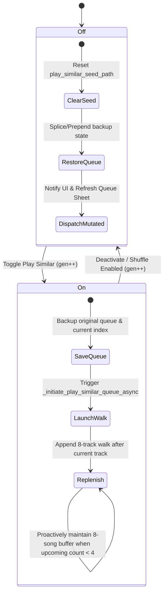

# Auto-Playlist Engine: $k$-NN Similarity Graph & Walkers

> [!NOTE]
> **Architecture**; The music recommendation system is built on a continuous, high-performance **$k$-NN Hybrid Similarity Graph**. This provides the fluid, adaptive, and infinite transitions necessary for the voice assistant's playback pipelines.

> [!TIP]
> **Bioinformatics Origins**; This engine was inspired by similarity matrices in bioinformatics (mapping tracks to a multi-dimensional feature space and building a sparse topological network for traversal walks instead of discrete buckets).

---

## The Hybrid Recommendation Pipeline

The engine bridges low-level digital signal processing (DSP) and high-level relational metadata to construct a sparse, dual-tier directed network of similar tracks:

```text
audio file ──► MediaCodec (Android) ──► mono int16 PCM @ 22050 Hz (120s)
                                                   │
                                                   ▼
                                        Pure-Numpy DSP Analyser
                                                   │
        ┌─────────────────────┬────────────────────┼────────────────────┬─────────────────────┐
        ▼                     ▼                    ▼                    ▼                     ▼
  RMS energy (dB)      Spectral centroid    Spectral rolloff   Onset-flux autocorr   Mel-filterbank STFT
                        (brightness)         (85th-pct freq)    + 120-BPM prior              │
                                                                 │                            ▼
                                                                 ▼                  log → DCT-II → MFCC
                                                           BPM + beat strength               │
                                                                                   ┌──────────┼──────────┐
                                                                                   ▼          ▼          ▼
                                                                              MFCC mean   MFCC std   chroma
                                                                              + rhythm    (timbre)    (12)
                                                                                (36)        (20)      
                                                                                   │          │          │
                                                                                   └──────────┼──────────┘
                                                                                              ▼
                                                                                   88-D Packed Profile
                                                                                              │
                                                                                     (Drop MFCC Delta)
                                                                                              ▼
                                                                                     68-D Graph Embedding
                                                   │
                                                   ▼
               68-D Graph Embedding + covariance-surviving scalars
                                                    │
                                          ┌─────────┴──────────┐
                                          ▼                    ▼
                            Continuous (timbre+dynamics)   Harmonic (cos_h/sin_h/key_mode)
                            Z-score → ×1.5 scalar boost   Z-score (separate μ/σ)
                                          │                    │
                                          ▼                    │
                            Kaiser-truncated PCA (~20-D)       │
                                          │                    ▼
                                           └──── concat ◄── ×1.5 harmonic weight
                                                    │
                                                    ▼
                                            Zr  (~23-D, un-normalised)
                                                   │
                                                   ▼
                             Acoustic Euclidean Self-Tuning Affinity Graph
                                 (Top K=20 nearest neighbours, mutual-kNN)
                                                   │
          Junction Metadata Edges ◄─────────────────┼────────────────► Same-Artist / Album Edges
       (Album sequence / Recent additions)          │                  (Biased distance weighting)
                                                    ▼
                           HYBRID k-NN ADJACENCY NETWORK  +  Louvain communities
                                                   │
                                                   ▼
                 Personalised-PageRank Walker 
                   (restart · softmax τ · MMR ·    (scalar-percentile targets ·
                    multi-tier · persistent avoid)  Camelot)
                                                   │
                                                   ▼
                                     Seamless Dynamic Playback Queue
```

---

## 1. Feature Extraction & Vector Space (v4)

Acoustic vectors are extracted by a pure-NumPy DSP analyzer (no Librosa, no SciPy; works on every host). The analyser is invoked from the laptop-side offload script (see §7); the on-device fallback exists but is no longer the primary path because library-wide DSP on a phone is impractically slow (10+ s/track vs ~200 ms/track on a laptop).

### The 88-Dimensional Packed Profile and 68-Dimensional Graph Embedding (v4, `FEATURES_VERSION = 4`)

#### Quick reference; what each feature tells you about a track

| Field | Shape | What it captures | What "high" sounds like |
|---|---|---|---|
| `log_bpm` | scalar | Log2 of estimated tempo | Drum & bass, techno |
| `energy` | scalar [0,1] | dB-mapped RMS loudness | Loud / dense mix |
| `brightness` | scalar [0,1] | Spectral centroid / Nyquist; "centre of mass" of the spectrum | Bright synth leads, cymbals |
| `rolloff` | scalar [0,1] | Frequency below which 85% of the energy lives | Sharp high-frequency content |
| `beat_strength` | scalar [0,1] | Confidence in the BPM estimate (autocorr peak height) | Steady kick-driven dance |
| `spectral_flatness` | scalar [0,1] | Wiener entropy: tonal (low) ↔ noisy (high) | White noise, distortion |
| `spectral_contrast` | scalar [0,1] | Peak-to-valley dB across sub-bands | Clear melody over quiet floor |
| `cos_h` | scalar | Cosine component of Camelot key clock | (drives key similarity projection) |
| `sin_h` | scalar | Sine component of Camelot key clock | (drives key similarity projection) |
| `key_mode` | scalar | 1.0 for major (Camelot B-ring), 0.0 for minor (A-ring) | (drives major/minor mode grouping) |
| `mfcc_mean` | 20 floats | Average **timbre fingerprint**; "what instruments / kind of sound" | (vector; cosine compared track-to-track) |
| `mfcc_std` | 20 floats | Timbral spread / **dispersion**; variation of timbre over time | (vector; captures timbral variation) |
| `mfcc_delta` | 20 floats | How fast timbre changes frame-to-frame (dropped for similarity graph) | (vector; captures timbre evolution/speed) |
| `chroma` | 12 floats | Proportion of each pitch class (C, C#, D, …) | (vector; basis for the K-S key estimate) |
| `rhythm` | 16 floats | Groove, tempogram components, onset density, and pulse clarity | (vector; distinguishes rhythm styles/speeds) |

The raw scalars get their own DB columns. The 88-D sound profile (`mfcc_mean` + `mfcc_std` + `mfcc_delta` + `chroma` + `rhythm`) is packed as a `float32` LE BLOB in `play_counts.timbre`.
However, because feature-group ablation tests showed `mfcc_delta` carries no genre signal on its own and dilutes the Euclidean metric, it is dropped from the similarity graph view.
Thus, the similarity graph consumes a **68-dimensional graph embedding** (`GRAPH_EMBED_DIMS` = 68), which combines:
- `mfcc_mean` (20 dimensions)
- `mfcc_std` (20 dimensions)
- `chroma` (12 dimensions)
- `rhythm` (16 dimensions)

Together with the 10-dimensional scalar descriptors from the DB columns, this results in a **78-dimensional build space** before SVD/PCA.

#### Component details

1. **88-Dimensional Sound Profile** (packed as one `float32` LE BLOB on `play_counts.timbre`):
   * **MFCC Mean (20 dimensions)**: Average spectral envelope of the HPSS-harmonic component (cleaner timbre; no kick-drum bleed into the mel cepstrum).
   * **MFCC std (20 dimensions)**: Standard deviation of MFCC coefficients across frames, capturing timbral spread/dispersion over time.
   * **MFCC Δ-Mean (20 dimensions)**: First-order temporal derivative of MFCC, averaged across frames. Captures *how* timbre evolves (excluded from graph traversal/similarity edges).
   * **Chroma Pitch Profile (12 dimensions)**: Pitch-class profile of the HPSS-harmonic component; the basis for both the harmonic-similarity score and the Krumhansl–Schmuckler key estimate.
   * **Rhythm Profile (16 dimensions)**: Groove descriptors derived from the HPSS-percussive onset envelope (full-band, low-band, and high-band beat-relative tempogram rates, onset density, ratio, and pulse clarity).

2. **10-Dimensional Scalar Descriptors** (assembled during edge building):
   * **log_bpm**: Log2 of the estimated BPM, reflecting multiplicative/octave-based tempo perception.
   * **Beat Strength**: Autocorrelation height at the chosen tempo lag; serves as a confidence/regularity score in `[0, 1]`.
   * **Energy (RMS)**: dB-mapped loudness in `[0, 1]`.
   * **Brightness (Spectral Centroid)**: Normalised by Nyquist to `[0, 1]`.
   * **Spectral Rolloff**: 85th-percentile cutoff frequency, normalised to `[0, 1]`.
   * **Spectral Flatness** (Wiener entropy): Per-frame geometric/arithmetic-mean ratio, averaged.
   * **Spectral Contrast**: Mean peak-to-valley dB difference across six frequency sub-bands, normalised to `[0, 1]`.
   * **cos_h / sin_h**: The Camelot key hour mapped as coordinates on a unit circle, ensuring that Euclidean distance matches perfect-fifth compatibility on the Camelot clock.
   * **Key Mode**: 1.0 for major (B-ring) and 0.0 for minor (A-ring), distinguishing relative major/minor keys.

### Harmonic-Percussive Source Separation (HPSS)
Before MFCC, chroma and onset detection run, the magnitude spectrogram is split into harmonic and percussive components via median filtering (Fitzgerald 2010):
* A time-axis median filter (kernel ≈ 400 ms) reveals sustained harmonic content; a frequency-axis median filter (kernel ≈ 180 Hz) reveals broadband percussive transients.
* A soft Wiener-style mask combines the two filtered spectrograms into `H` and `P`.
* **MFCC + chroma** run on `H` only; much cleaner timbre and pitch estimates because kick-drum transients no longer bleed into the mel cepstrum or the chroma pitch buckets.
* **Onset detection** runs on `P` only; substantially better BPM estimates on slow, sparse or syncopated tracks where the unseparated spectrum used to confuse the autocorrelation.

Implementation is in `StreamripApp/utils/dsp.py` (`_hpss`, `_median_filter_axis`). Pure NumPy; `scipy.signal.medfilt2d` is deliberately avoided so the analyser has zero native dependencies.

---

## 2. Graph Construction Mechanics

The backend [DatabaseManager](file:///Users/chrismitsacopoulos/Desktop/Mai-An-Lab/StreamripApp/utils/db_manager.py) and [track_graph.py](file:///Users/chrismitsacopoulos/Desktop/Mai-An-Lab/StreamripApp/utils/track_graph.py) build a sparse $k$-NN database table (`track_neighbors`) split into two distinct tiers.

### A. The Acoustic Similarity Tier (`edge_kind = 'acoustic'`)
The engine loads every track with a current-version feature BLOB and assembles a feature row from the 68-D graph embedding block plus the scalar descriptors that survive covariance cleaving.

* **Covariance cleaving (centrality).** A Pearson-correlation pass over the continuous raw scalars (`bpm`, `brightness`, `energy`, `rolloff`, `beat_strength`, `spectral_flatness`, `spectral_contrast`) removes redundant ones: within any group correlating at $|r| \ge 0.70$, the feature with the highest mean $|r|$ to the group — its best representative — is kept and the rest dropped. The harmonic coords `cos_h`/`sin_h`/`key_mode` are structural and always kept (they are late-fused after PCA — see below). The surviving scalars are appended to the 68-D graph embedding block (≈75-D on a typical library).

* **Standardisation (Z-Scoring)**; putting every feature on a common ruler. Each column is centred on mean 0 and scaled to unit standard deviation:
  $$Z_{ij} = \frac{X_{ij} - \mu_j}{\sigma_j}$$
  so every feature contributes proportionally to its *spread across the library*. The per-column $\mu$/$\sigma$ are persisted with the projection so any new or exemplar track projects identically.

* **Scalar Boosting**: after scaling, the non-harmonic scalar columns are multiplied by `scalar_weight = 1.5` so tempo and dynamics carry weight comparable to the 68 individual graph embedding axes. The harmonic columns (`cos_h`, `sin_h`, `key_mode`) are **not** boosted here — they are handled separately by the late-fusion step below.

* **Late Fusion PCA reduction (Kaiser).** The harmonic unit-circle coordinates (`cos_h`, `sin_h`, `key_mode`) encode the rigid Camelot wheel geometry. Because PCA is a global linear rotation, running SVD on these columns would destroy the geometric integrity of the 12-hour circle. The engine therefore uses a **Late Fusion** strategy:
  1. The z-scored feature matrix is **split** into a continuous block (68-D graph embedding + surviving non-harmonic scalars, ~75-D) and a harmonic block (3-D: `cos_h`, `sin_h`, `key_mode`), each z-scored with its own $\mu$/$\sigma$.
  2. A thin SVD reduces **only the continuous block** to the components with eigenvalue $> 1$ (Kaiser; floored at 3), giving $Z_{r,\text{cont}}$ (typically ~20-D to 30-D). $Z_{r,\text{cont}}$ is kept **un-normalised**: Euclidean distance here preserves magnitude — how far a track sits from the library's "average" — which is real perceptual signal.
  3. The raw z-scored harmonic coordinates are multiplied by `harmonic_weight = 1.5` and **concatenated** back onto $Z_{r,\text{cont}}$, producing the final unified coordinate space $Z_r$ (typically ~23-D to 33-D).

  This guarantees that Euclidean distance in $Z_r$ matches perfect-fifth compatibility on the Camelot clock with 100% fidelity, while PCA still denoises the high-dimensional timbre and dynamics axes. The projection ($\mu_{\text{cont}}$, $\sigma_{\text{cont}}$, $\mu_{\text{harm}}$, $\sigma_{\text{harm}}$, surviving-feature list, $V_{\text{keep}}$, `harmonic_weight`) and every track's $Z_r$ coordinates are persisted in `pca_space` / `play_counts.pca_coords`; this single geometry drives the walk and clustering.

* **Euclidean k-NN ($K=20$)**: each track's 20 nearest neighbours in $Z_r$ are found by squared-Euclidean distance, computed in 256-row blocks (`argpartition` is $O(N)$ per row; the K-slice is then ordered with a $O(K \log K)$ sort).

* **Self-tuning affinity (Zelnik-Manor)**: each distance becomes an affinity $a_{ij} = \exp\!\big(-d(i,j)^2 / (\sigma_i \sigma_j)\big) \in (0,1]$, where $\sigma_i$ is $i$'s distance to its 7th-nearest neighbour. The local $\sigma$ adapts the kernel to each track's neighbourhood density, so a sparse outlier and a dense-cluster member get comparable affinities.

* **Mutual-kNN Pruning**; fighting popularity bias. An edge $(i \to j)$ is kept **iff $j$ is in $i$'s top-K AND $i$ is in $j$'s top-K**:
  $$E_{\text{mutual}} = \{(i,j) : j \in \text{topK}(i) \;\land\; i \in \text{topK}(j)\}$$
  A hub track — say a generic acoustic-guitar track — is geometrically close to many others and appears in *everyone's* top-K, but its own top-K points back into one dense cluster. The intersection keeps only symmetric edges, flattening that over-representation without removing the geometric signal. The self-tuning affinity is symmetric in $i,j$, so the pruned graph is undirected.

### B. The Metadata Co-Occurrence Tier
When acoustic data is missing or needs to be augmented, the engine falls back to relational metadata connections:
* **Same-Album Edges (`edge_kind = 'album'`)**: Connects all tracks belonging to the same album. The weight scales inversely with their track distance in the tracklist to preserve natural listening transitions:
  $$w = \frac{1.0}{1.0 + 0.1 \times (\text{distance} - 1)}$$
* **Same-Artist Edges (`edge_kind = 'artist'`)**: Links tracks from the same artist (capped at $K=30$ per track to prevent prolific artists from flooding the table), sorted and biased toward newer releases (`added_date DESC`).

### C. Louvain Community Detection
During the graph rebuild, the engine partitions the library into acoustic communities by **Louvain modularity optimisation** on the mutual-kNN affinity graph from §2.A — the same weighted graph the walker traverses, so communities and similarity share one geometry.

1. **Substrate**:
   The undirected, self-tuning-affinity-weighted mutual-kNN edges are the input; clustering operates on the graph topology, not on coordinates.
2. **Algorithm**:
   A pure-NumPy/Python Louvain (Blondel et al. 2008) greedily moves each node to the neighbouring community that most increases modularity, then contracts every community into a super-node and repeats on the smaller graph. The number of communities emerges from the topology — there is no `k` to choose — and a `resolution` knob (default 1.0) trades community count against size. No native dependencies, so it runs on-device.
3. **Output**:
   Each track's `cluster_id` is persisted in the `play_counts` table; tracks with no mutual neighbours form singleton communities. The walker consumes `cluster_id` as a soft cross-community penalty (§3.6).

---

## 3. Stateful Graph Traversal (Personalised-PageRank Walker)

The voice assistant runs a **personalised-PageRank-flavoured random walk** with five behavioural levers: anchoring (restart), exploration (softmax temperature), diversity (MMR), tier-aware pooling, and negative-centroid avoidance. When a user says *"play more like this"*, the walker traverses the graph from the current track's seed.

Each step does three things: **gather candidates → score them → sample one**. The subsections below cover each of these in turn.

### 3.1 Gather; multi-tier candidate pooling

Each step pools acoustic + artist neighbours into one candidate set, then attaches a per-tier multiplier before any scoring math happens:

$$\text{effective\_weight}(c) = \text{raw\_weight}(c) \times \mu_{\text{tier}(c)}$$

with $\mu_{\text{acoustic}} = 1.0$, $\mu_{\text{artist}} = 0.4$, $\mu_{\text{album}} = 0.2$. An acoustic neighbour at affinity 0.9 has effective weight 0.9; an artist neighbour at raw weight 1.0 has effective weight 0.4. The walker therefore prefers acoustic edges by default but artist edges catch it when acoustic edges are absent; including mid-walk, not just at the seed.

When the same track appears in two tiers (e.g. an acoustic neighbour that's also same-artist), the merge keeps the **maximum effective weight** so the stronger signal wins and the candidate appears exactly once in the pool.

### 3.2 Score; composite logit

The per-candidate logit is a composite of edge affinity, metadata fusion, diversity, negative feedback, and community constraint penalties computed before the softmax:

$$\text{logit}_c = \Big( \big( w_c \cdot \mu_{\text{tier}(c)} \cdot (1 + \lambda_{\text{meta}} \cdot S_{\text{meta}}) \big) - \lambda_{\text{MMR\_eff}} \cdot \max_{v \in \text{visited}} \cos(e_c, e_v) - \lambda_{\text{neg}} \cdot \max_{r \in \text{rejected}} \cos(e_c, e_r) \Big) \cdot \mathbf{penalty}_{\text{comm}}$$

where the community constraint scales the entire logit:

$$\mathbf{penalty}_{\text{comm}} = \begin{cases} 1.0 & \text{if } \text{community}_c = \text{community}_{\text{current}} \text{ or either is None} \\ 1 - \lambda_{\text{comm}} & \text{if } \text{community}_c \neq \text{community}_{\text{current}} \end{cases}$$

Here, $\lambda_{\text{comm}}$ corresponds to the parameter `cluster_lambda` in the walker signature (default 0.5), which penalizes transitions into different Louvain modularity communities.

| Term | Default | Purpose |
|---|---|---|
| $\lambda_{\text{comm}}$ | 0.5 | Multiplicative penalty on candidates in a different Louvain community from the current track, biasing the walk toward the current sonic neighbourhood |
| $\lambda_{\text{MMR}}$ | 0.15 | Penalises candidates close in timbre to already-visited nodes; decays as $\lambda_{\text{MMR}}/(1+\text{step})$ so later steps stay anchored to the seed |
| $\lambda_{\text{neg}}$ | 0.6 | Penalises candidates close in timbre to session-rejected tracks (skips/dislikes) |

### 3.3 Score; softmax temperature

The softmax converts logits to probabilities:

$$p_i = \frac{e^{\text{logit}_i / \tau}}{\sum_j e^{\text{logit}_j / \tau}}$$

A single flat temperature $\tau$ governs the whole walk (default 0.04; small → near-greedy, large → near-uniform). Before exponentiating, each node's logits are **z-standardised** (subtract mean, divide by std) so $\tau$ has the same meaning everywhere regardless of how that node's candidate affinities are spread; the code also subtracts $\max_j$ for numerical stability (softmax is shift-invariant).

The **MMR diversity penalty** (Maximal Marginal Relevance) is the subtractive term in the composite logit. For each candidate $c$ we compute its maximum cosine to anything already in the walk:

$$\text{logit}_c \mathrel{-}= \lambda_{\text{MMR\_eff}} \cdot \max_{v \in \text{visited}} \cos(\text{timbre}_c, \text{timbre}_v)$$

with $\lambda_{\text{MMR\_eff}} = 0.15 / (1 + \text{step})$ by default. If candidate $c$ sounds very similar to a track we already added, subtract $\lambda \times$ that similarity from its logit. The walker still prefers candidates similar to the *seed* (high affinity via the edge) but inside that pool prefers candidates that are *different from each other* — a small sliver of seed-similarity traded for more variety across repeated *play similar* calls from the same seed.

### 3.4 Sample; Personalised-PageRank restart

Before sampling from the softmax, with probability $\alpha = 0.15$, the walker **teleports back to the teleport target** instead of stepping forward from `current`. The teleport target defaults to the seed but can be overridden (e.g. to anchor back to the original seed when Play Similar mode dynamically appends tracks from the current playing position). This is the *personalised PageRank* trick; the random surfer occasionally jumps to a preferred page rather than following an outlink. The stationary distribution is:

$$P_{\text{stationary}}(v) = \alpha \cdot \mathbb{1}[v = \text{teleport}] + (1-\alpha) \sum_u P(u) \cdot \text{transition}(u, v)$$

That $\alpha$ fraction is the **anchor**. Without it, the walker's distance from the seed grows roughly linearly with step count and you end up far afield; a "play similar" sequence ten steps in would have basically forgotten the seed. With it, the walker effectively averages over "where do I get to in $1/\alpha \approx 6.6$ steps before being yanked back?"; and the resulting playlist concentrates around the seed's true neighbourhood regardless of length.

### 3.5 Persistent avoidance and batched prefetch

* **Persistent avoidance set**: the `avoid` set passed into `walk()` unions the assistant's in-memory recent list with the on-disk `playback_history` table (7-day window). Tracks the user heard yesterday don't reappear today, even across app restarts. See §4.4 for the table schema.

* **Batched 2-hop prefetch**: `walk()` issues **one** query at the start that materialises the seed's 1-hop neighbours and then the 1-hop neighbours of every 1-hop neighbour (the 2-hop horizon). The walker then steps entirely in memory through that subgraph. Length-12 walks cost one DB round-trip plus the small fan-out queries, instead of twelve sequential awaits.

### 3.6 Louvain Community Walker Constraint

To keep walks within cohesive sonic boundaries and stop them drifting across major genre divisions, the walker applies a soft community penalty.
At each step, candidates in a different Louvain community (§2.C) from the current track have their effective weights multiplied by $(1 - \lambda_{\text{comm}})$ (implemented via `cluster_lambda` in the signature):

$$\text{effective\_weight} \leftarrow \text{effective\_weight} \times (1 - \lambda_{\text{comm}})$$

By default, $\lambda_{\text{comm}} = 0.5$ (halving the weight). If either the candidate or the current track lacks a `cluster_id` (e.g. a singleton community, or before the first graph build), no penalty is applied. This biases the walk to explore the local community while keeping bridge tracks open for transitions.

### 3.7 The walker in pseudocode

```text
fn walk(seed, length, kinds, weights, α, λ_mmr, λ_neg, τ, avoid, teleport, community_map, λ_comm):
    horizon       = prefetch_two_hop(seed, kinds)     # one SQL round-trip
    visited       = avoid ∪ {seed}
    visited_embs  = [embedding(seed)] if available else []
    neg_embs      = [embedding(r) for r in session_rejected]
    current       = seed
    output        = []

    repeat length times:
        step = len(output)

        # 3.4: anchor (Personalised-PageRank teleport)
        if uniform() < α:
            current = teleport

        # 3.1: gather
        candidates = horizon[current]
        candidates = merge_tiers(candidates, weights, exclude=visited)
        if candidates is empty:
            if current ≠ teleport: current = teleport; continue
            else: break

        # 3.2: composite logit calculation
        # Base weights/affinity + metadata fusion boost
        logits = [c.effective_weight for c in candidates]
        if meta_active:
            for i, c in enumerate(candidates):
                logits[i] *= (1.0 + λ_meta * meta_score(current, c.path))

        # Additive diversity (MMR) & negative centroid penalties
        λ_mmr_eff = λ_mmr / (1.0 + step)
        if λ_mmr_eff > 0 and visited_embs:
            for i, c in enumerate(candidates):
                logits[i] -= λ_mmr_eff * max(cos(emb(c), v) for v in visited_embs)
        if λ_neg > 0 and neg_embs:
            for i, c in enumerate(candidates):
                logits[i] -= λ_neg * max(cos(emb(c), r) for r in neg_embs)

        # 3.6: Louvain community constraint applied to final logit
        curr_comm = community_map.get(current)
        for i, c in enumerate(candidates):
            c_comm = community_map.get(c.path)
            if curr_comm is not None and c_comm is not None and c_comm != curr_comm:
                logits[i] *= (1 - λ_comm)

        # 3.3: flat-temperature softmax over per-node z-standardised logits
        probs  = softmax(zstandardise(logits) / τ)
        chosen = sample(candidates, probs)

        output.append(chosen)
        visited.add(chosen)
        if embedding(chosen) exists:
            visited_embs.append(embedding(chosen))
        current = chosen

    return output
```

The reference implementation is in [track_graph.walk()](file:///Users/chrismitsacopoulos/Desktop/Mai-An-Lab/StreamripApp/utils/track_graph.py); the function signature exposes every knob (`restart_prob`, `diversity_lambda`, `negative_lambda`, `temperature`, `cluster_lambda`, `edge_kind_weights`, `teleport_path`, …) so different intents can re-tune the walker without touching the algorithm. A hypothetical *play discovery* intent would use $\tau = 0.2$, $\alpha = 0.05$, $\lambda = 0.5$; same code path, different point in the trade-off space.

---

### 5.1 The Camelot wheel

The **Camelot wheel** is the DJ industry's de-facto re-numbering of the 24 keys (12 major + 12 minor) so that musically compatible keys sit at adjacent positions on a clock. Two concentric rings:

* **Outer ring ("B" = Bright = major)**: `1B = B major`, `2B = F♯ major`, `3B = D♭ major`, …, `12B = E major`.
* **Inner ring ("A" = minor)**: `1A = G♯ minor`, `2A = D♯ minor`, …, `12A = D♭ minor`.

Two tracks are **harmonically compatible** if any of these holds:

| Relationship | Camelot move | Example | Distance |
|---|---|---|---|
| Same key | 8B → 8B | C major → C major | 0 |
| Relative major/minor (same hour, opposite ring) | 8B → 8A | C major → A minor | 0 |
| ±1 hour, same ring (perfect 4th / 5th) | 8B → 9B | C major → G major | 1 |
| ±1 hour, opposite ring | 8B → 9A | C major → E minor | 2 |
| Further apart | … | … | 3–6 |

The full pitch-class → Camelot table lives in `utils/harmonic.py` (`_MAJOR_HOUR`, `_MINOR_HOUR`); derived from the standard Mixed In Key reference. `key_index_to_camelot(k)` returns the `(hour, ring)` tuple for any `key_index` in [0, 23] (your `dsp.py`'s Krumhansl-Schmuckler estimate).

### 5.2 The harmonic distance + penalty

`camelot_distance(a, b)` returns a symmetric integer in `[0, 6]`:

```text
if either key unknown:        return 6   (max; penalises tracks lacking a key estimate)
if same ring:                  return min(|hour_a - hour_b|, 12 - |hour_a - hour_b|)
if opposite ring and same hour: return 0  (relative major/minor)
if opposite ring otherwise:    return min(hour_dist + 1, 6)
```

The normalised penalty divides through by the max:

$$\text{camelot\_penalty}(a, b) = \frac{\text{camelot\_distance}(a, b)}{6} \in [0, 1]$$

---

## 6. End-to-End Trace

Walking through a concrete request makes the moving parts visible. Suppose the user is listening to **"Weightless" by Marconi Union** (ambient, ~60 BPM, low energy, D minor = `7A`) and says *"play similar"*.

### 6.1 The walker fires

1. **Prefetch**: `track_graph.walk()` issues one query for the seed's 1-hop neighbours (acoustic + artist) and then 1-hop queries for each of those, materialising the 2-hop horizon in memory.
2. **Step 1; gather**. Three candidates among the seed's neighbours (after multi-tier merge):
   - **Another Marconi Union track**; acoustic edge, affinity 0.93 → effective weight 0.93.
   - **"Avril 14th" by Aphex Twin**; acoustic edge, affinity 0.91 → effective weight 0.91 (timbre-twin: solo piano, similar MFCC).
   - **Random electronica track**; only an artist edge, raw 1.0 → effective $1.0 \times 0.4 = 0.40$.
3. **Step 1; score**. The effective weights $[0.93, 0.91, 0.40]$ are z-standardised per node and divided by the flat temperature $\tau = 0.04$, then softmaxed. The two acoustic twins sit far above the lone artist edge, so they split almost all the probability between them while the artist candidate is effectively excluded.
4. **Step 1; sample**: pick the Marconi Union track. Append to walk; add its embedding to `visited_embs`.
5. **Step 2; restart roll**: $\alpha = 0.15$ doesn't fire (we rolled 0.42). Step from the Marconi Union track.
6. **Step 2; MMR kicks in**. Another Marconi Union track (Track 3 from the same album) is the next acoustic-twin, ~0.95 affinity to the seed — but it's also ~0.95 cosine to *the just-added* Marconi Union track in the timbre sub-space. The MMR penalty subtracts $\lambda \cdot 0.95 = 0.15 \cdot 0.95 \approx 0.14$ from its logit, nudging it below Aphex Twin's "Avril 14th" (similarly slow piano, in a different community), so softmax now favours Avril.
7. **Step 3; restart fires**. Roll 0.08 < $\alpha$ → teleport back to the seed. Score from the seed's neighbours again, but Marconi Union Track 1 and "Avril 14th" are in `visited` (filtered out) AND their embeddings still apply MMR pressure on whatever else surfaces.

Repeat for 12 steps. The walk explores the seed's neighbourhood without drifting into unrelated genres (restart), without producing 12 Marconi Union tracks in a row (MMR), and without re-recommending anything the user heard yesterday (persistent avoid set).

---

## 7. Laptop-Offload Analysis Pipeline

Library-wide DSP on a phone is impractically slow; a typical Android device takes 10+ seconds per track for decode + feature extraction. The same numpy pipeline runs in roughly 200 ms per track on a modern laptop, so all bulk feature extraction has been moved to a host-side script. The on-device app never needs to compute features itself; it just consumes whatever is already in the `play_counts.timbre` BLOB.

> [!IMPORTANT]
> **Prerequisite: USB Debugging Enabled**
> In order for `adb` to perform the file transfers and setup, you must enable **USB Debugging** on your Android device:
> 1. On your phone, go to **Settings** → **About phone** and tap **Build number** 7 times to unlock Developer Options.
> 2. Go to **Settings** → **System** → **Developer options** (or search for it in Settings).
> 3. Scroll down and enable **USB debugging**.
> 4. Connect your phone to your laptop via a USB cable.
> 5. Open a terminal on your laptop, run `adb devices`, and authorize the debugging connection on your phone when prompted.

The mechanism reuses the existing **App State Bundle** export/import plumbing (see Settings → Advanced → Export State / Import State); there is no separate sync protocol; the bundle is the wire format.

### 7.1 Automated Offload Script

The automated offload script (`tools/auto_offload.sh`) runs feature extraction by exchanging files through the public external storage directory (`/sdcard/Download`). This mechanism avoids using `run-as` permissions or direct access to the app's internal sandbox, making it compatible with both release and debug APK builds.

To execute the automated offload:

1. **Export State**: In the app on the phone, navigate to **Settings** → **Advanced** → **Export State** and save the ZIP archive to the phone's **Download** folder.
2. **Run Script**: Execute the offload script from the laptop terminal:
   ```bash
   ./tools/auto_offload.sh
   ```

#### Script Operations:
1. **Pull State Bundle**: Finds the most recently exported state ZIP file in `/sdcard/Download`, pulls it to a temporary directory on the host machine, and extracts it.
2. **Feature Extraction**: Invokes `tools/dsp_offload.py` to analyze missing tracks in parallel using a ThreadPoolExecutor with 4 concurrent workers.
3. **Resource Cleanup**: 
   * Deletes intermediate decoded `.pcm` files immediately after feature extraction.
   * Deletes downloaded raw compressed audio files (`.mp3`, `.flac`, etc.) immediately after feature extraction.
4. **Archive Preservation**: Saves a persistent copy of the finished analyzed state bundle to `tools/analyzed_states/` on the laptop, preserved under its original timestamped name with an `.analysed.zip` suffix.
5. **Import and Phone Cleanup**:
   * Pushes the analyzed bundle to the phone's `/sdcard/Download/mai_an_lab_state_import.zip`.
   * Deletes the original exported ZIP file from `/sdcard/Download` on the phone.
   * Restarts the app process to trigger the startup hook, which imports the state database and deletes the `mai_an_lab_state_import.zip` file.

### How the Script Works

`tools/dsp_offload.py` is a self-contained CLI. It requires `adb` and `ffmpeg` on `PATH` and reuses the on-device feature pipeline directly (via `sys.path` injection of `StreamripApp/utils/dsp.py`) so any change to the analyser is picked up automatically; there is no duplicated DSP math.

For each tracks-needing-features bundle:

1. **Inspect**: opens the bundle ZIP, queries `library.db` for paths whose `features_version` is absent or stale.
2. **Chunked ADB transfer**: groups missing paths into chunks (default 100), writes each chunk's list to `/sdcard/.dsp_offload_pull_list.txt`, then streams the chunk through a single `adb exec-out tar -cf - -T <list>` pipe into a local `tar -xf -`. Paying the ~50–200 ms ADB handshake once per chunk instead of once per file is the dominant speed win; for 1100 small files this saves several minutes of pure overhead before any bytes have moved.
3. **Parallel decode + extract** per chunk: `ffmpeg` decodes each cached file to a 120 s mono PCM clip; numpy runs the full v3 pipeline (HPSS, MFCC + deltas, chroma, scalars). A `ThreadPoolExecutor` overlaps `ffmpeg` subprocesses with numpy work because both release the GIL.
4. **Batched DB write per chunk**: a single `BEGIN/COMMIT` transaction upserts the entire chunk's features. Orders of magnitude faster than per-track commits; the chunk boundary is also a safe checkpoint; if the script is killed mid-run, all *finished* chunks survive in the bundle DB and the next run picks up cleanly from the audio cache.
5. **Repackage**: writes `<bundle>.analysed.zip` (or `--in-place` to overwrite). The repackager preserves any file in the original bundle the script didn't touch (`config.toml`, `recent_searches.json`, future manifest extensions).

### CLI Flags

| Flag | Default | Notes |
|---|---|---|
| `bundle` |; (required) | Path to the exported `.zip`. |
| `--out PATH` | `<bundle>.analysed.zip` | Output bundle path. |
| `--in-place` | off | Overwrite the input bundle. |
| `--serial SERIAL` | auto | Pick a specific ADB device. |
| `--concurrency N` | 4 | Parallel decode+extract workers per chunk (CPU-bound). |
| `--chunk-size N` | 100 | Tracks per ADB tar batch. Higher = fewer handshakes, more disk used between batches. |
| `--workdir DIR` | tempdir | Reusable cache for pulled audio + intermediate PCMs. Persistent across runs if specified. |
| `--keep-workdir` | off | Don't delete the workdir on exit. |

### Idempotency & Caching

The work directory holds two parallel caches:

* `audio_cache/storage/emulated/0/...`; pulled audio files, keyed by their on-device absolute path. `tar` preserves the full path structure, so a re-run with the same `--workdir` skips the pull for any file that already exists locally.
* `<audio>.pcm` next to each cached audio file; the intermediate decoded PCM. Survives between runs so re-running the script after a feature-pipeline tweak skips re-decoding (cheap) but redoes extraction.

If a track's `features_version` is current in the bundle DB, it's already filtered out by step 1, so the script naturally resumes from where it left off without any explicit checkpoint logic.

### Safety Properties

* **Bundle DB schema is defensively migrated**: the script's `_upsert_chunk` runs `ALTER TABLE ADD COLUMN` for any v3 columns missing from a pre-v3 bundle. The script works standalone against any bundle without requiring the user to bump the app first.
* **No host-side audio files retained beyond the work directory.** No upload to remote services; everything stays on your laptop.
* **Bundle round-trip is non-destructive**: the original `<bundle>.zip` is untouched unless `--in-place` is passed.
* **`FEATURES_VERSION` is read from the app's `utils/dsp.py`**; the script can never write features that disagree with the on-device extractor's expected version, because they share one source of truth.

---

## 8. PCA Engine & Coordinate Projection

The unified coordinate space $Z_r$ (§2.A) is the engine's single projection. `build_acoustic_edges` persists it: the continuous projection ($\mu_{\text{cont}}$, $\sigma_{\text{cont}}$, surviving-feature list, $V_{\text{keep}}$ loading matrix) and the harmonic z-score stats ($\mu_{\text{harm}}$, $\sigma_{\text{harm}}$, `harmonic_weight`, `harmonic_names`) in the `pca_space` table (via the `feature_spec` JSON column), and every track's $Z_r$ coordinates in `play_counts.pca_coords`.

### 8.1 Projecting a new track

`project_to_zr(row, projection)` places any track absent from the last build — a new import, or an islet exemplar — into that same space. It replicates the Late Fusion split from §2.A: assemble the 68-D graph embedding timbre block + surviving scalars, split off the harmonic columns, z-score each part with its own persisted $\mu$/$\sigma$, apply the ×1.5 scalar boost to the continuous scalars, project the continuous part through $V_{\text{keep}}$, then concatenate the raw weighted harmonics: $Z_r = [z_{\text{cont}} \cdot V_{\text{keep}} \;|\; z_{\text{harm}} \times w_{\text{harm}}]$. A legacy fallback handles projections saved before the late-fusion change (no `harmonic_names` in `feature_spec`).

### 8.2 On-Device Mathematical Truth Report

After every graph rebuild (`build_acoustic_edges`), the engine calls `pca_engine.plot_pca_report(rows, output_dir)` to generate five PNG figures:

| File | Content |
|---|---|
| `covariance_heatmap_full.png` | Pearson correlation heatmap — all 8 features, lower-triangle mask |
| `pca_scatter_full.png` | PC1 vs. PC2 biplot scatter coloured by energy; eigenvector arrows for all 8 features |
| `covariance_heatmap_pruned.png` | Correlation heatmap of the pruned active-feature subset |
| `pca_scatter_pruned.png` | Biplot scatter after cleaving, using the second-pass SVD loadings |
| `pca_scatter_clusters.png` | PC1 vs. PC2 scatter plot coloured by Louvain community ID, featuring shaded convex hull contours (`alpha=0.08`), diamond centroid markers, and dotted grid lines |

Files are written to `<library_folder>/pca_report/` — the path the user has set under **Settings → Library folder** — making them immediately accessible through any file browser on the device. If no library folder is configured (abnormal; PCA requires scanned tracks), the fallback path is `APP_DIR/pca_report/`.

The report function uses `matplotlib.use("Agg")` (headless, no display required on Android) and guards both `matplotlib` and `seaborn` imports with `try/except ImportError`, so the entire visualization pipeline is a graceful no-op on environments where those packages are absent. The projection and analysis pipelines are not affected.

The identical figure logic also runs in the standalone desktop analysis tool `tools/pca_analysis.py`, which automatically discovers the most recent `.analysed.zip` in `tools/analyzed_states/` and produces the same five figures from the extracted `library.db`.

---

## 9. Play Similar Mode — Queue Lifecycle & Race Safety

To provide a seamless, non-destructive recommendation experience, Play Similar mode implements an advanced queue state machine with automated backup, restore, and asynchronous race-safety guards.

### 9.1 Queue State Machine & Restoration Logic

When the user activates Play Similar mode, the system preserves the existing listening session rather than clearing it. The state transition flow operates as follows:



#### A. Enable Path (Centralized State Transition)
1. **Shuffle Deactivation & Mutual Exclusivity**: Play Similar mode is mutually exclusive with Shuffle mode. Activating Play Similar automatically toggles Shuffle off.
2. **Queue Snapshot & Backup**: The active queue list and the current playback index are saved into `play_similar_saved_queue` and `play_similar_saved_index` respectively.
3. **Walk Initialization**: An asynchronous coroutine `_initiate_play_similar_queue_async(path, gen)` executes an 8-step similarity walk starting from the seed track.
4. **Splicing Execution**: The similarity walk results are spliced into the active queue immediately *after* the currently playing track. This ensures that the user's playback is completely uninterrupted while the upcoming queue is populated with recommendation-based tracks.
5. **Continuous Replenish Hook**: When the queue changes or the player transitions to a new track, if the number of upcoming tracks in the queue drops below 4, `_recommend_similar_async` performs a walk to append enough new candidates to maintain an 8-song buffer ahead of the current track, enabling an infinite playback stream.

#### B. Disable Path (Non-Destructive Restoration)
When deactivating Play Similar mode (or when Shuffle is enabled, which automatically deactivates it), the system restores the user's original queue context:
1. **Seed Invalidation**: The `audio_engine.play_similar_seed_path` is cleared to `""` immediately, preventing background tasks from triggering stale replenishment hooks.
2. **Queue Recovery**: The restore operation handles two distinct scenarios based on whether the currently playing track belongs to the original queue or was dynamically injected:

| Scenario | Condition | Restoration Behavior |
|---|---|---|
| **Original Track Active** | Current track exists in the saved queue. | **Queue Splicing**: The live queue is kept up to the current track, and the remaining portion of the saved queue is appended immediately after it. Playback is uninterrupted. |
| **Walk-Injected Track Active** | Current track is NOT present in the saved queue. | **Queue Prepending**: The current walk-injected track is prepended at index `0` so it can finish playing, and the entire saved queue is appended directly behind it. Playback continues on the current track, and the original playlist sequence resumes once it ends. |

3. **Context Cleanup**: The backup states `play_similar_saved_queue` and `play_similar_saved_index` are reset to `None`.
4. **UI Notification**: The `on_queue_mutated` handler is dispatched, and `QueueSheet.refresh` forces a UI sync.

### 9.2 Asynchronous Generation-Counter Race Guard

Because similarity walks and queue updates are handled via fire-and-forget background coroutines (`run_task`), a rapid sequence of toggles could lead to race conditions where stale walk results overwrite a newly restored or modified queue.

To guarantee absolute race-safety, the state manager utilizes a monotonic integer generation counter (`_play_similar_gen`):

1. **Increment on Mutation**: The generation counter is incremented by 1 *before* executing any state change or queue transition in `set_play_similar_mode`.
2. **Tri-Point Verification**: Every asynchronous playback recommendation routine (`_initiate_play_similar_queue_async` and `_recommend_similar_async`) is passed the generation token at launch and checks it at three crucial checkpoints:
   - **On Entry**: Before any network or database I/O is performed.
   - **Post-Await**: Immediately after the async `tg.walk()` call returns, catching any state transitions that occurred while waiting for the walk to complete.
   - **Pre-Mutation**: Directly before writing the new candidates into the active `audio_engine.queue`.
3. **Graceful Abort**: If the check fails at any of these points (meaning the generation has changed), the coroutine aborts silently without mutating the queue or player state.
