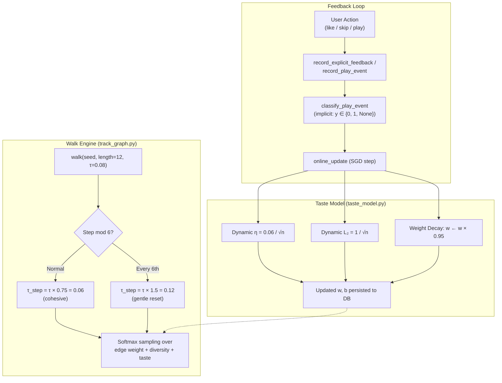

# UI Instructions: Library & Search

This document provides factual instructions for using the Mai-An Lab user interface, detailing the implementation of the Library and Search modules.

## 1. Library Management

The Library view (accessible via the **Library** tab) serves as the primary interface for managing and playing locally indexed music.

### 1.1 Indexing Music
- **Initial State**: If the database is empty, a prompt appears: "Your music library is currently empty. Index your folders to start listening."
- **Scan Button**: The **INDEX LIBRARY** button (or the Refresh icon in the top-right) triggers a recursive scan of the configured music folders.
- **Progress Tracking**: A progress bar and status label appear at the top of the Library view during an active scan.

### 1.2 View Modes & Navigation
The Library supports four distinct view modes, accessible via tabs at the top:
- **Playlists**: Lists user-created and imported playlists.
- **Artists**: Lists all unique artists. Expanding an artist reveals their albums.
- **Albums**: Lists all albums. Expanding an album reveals its tracks.
- **Tracks**: A flat list of all indexed tracks.

### 1.3 Searching & Filtering
- **Real-time Filtering**: The search bar at the top of the Library view filters the current list in real-time.
- **Debounced Input**: Search queries are debounced by **300ms** to ensure UI responsiveness on large libraries.
- **Clear Search**: A close icon ('X') appears when text is present, allowing for instant clearing of the filter.

### 1.4 Sorting
The Sort menu (accessible via the Sort icon) provides context-aware options:
- **Artists**: Sort by Name (A–Z), Most Tracks, or Most Albums.
- **Playlists**: Sort by Name (A–Z) or Date Created.
- **Albums/Tracks**: Sort by Date Added, Artist (A–Z), Album (A–Z), or Track (A–Z).

### 1.5 High-Performance Page Pagination & Snappy Transitions
To keep Flet’s widget tree extremely tiny and guarantee memory-safe, ultra-fluid library navigation even on massive multi-thousand-song catalogs:
- **Active Slicing**: Library listings (Tracks, Albums, Artists) are sliced into dynamic pages (typically **35 items per page**), rendering only one active page at a time.
- **Snappy Slide-In Carousel**: Switching pages initiates a lightning-fast hardware-accelerated **Slide-In Offset and Fade Animation** (optimized to a snappier **100ms** with a layout sleep delay of **80ms**), delivering a premium tactile feel.
- **Tactile Pagination Bar**: An elegant, glassmorphic pagination bar is rendered at the bottom of the screen.
- **Interactive Navigation**:
  - **Button Taps**: Tap the left or right chevron arrow buttons on the pagination bar to change pages.
  - **Interactive Boundary Ghost Cards**: Custom glassmorphic boundary ghost cards appear at the top and bottom of the list when scrolled to the limits. These cards are fully interactive and clickable; clicking the top ghost card instantly navigates to the previous page, and clicking the bottom ghost card instantly navigates to the next page.
  - *Note*: Horizontal swipe gestures for page turning are explicitly removed to prevent accidental or uncontrollable page switching during standard scrolling.

### 1.6 Default Moods, Feedback Controls & Profile Adaptation

The **Default Moods** pane (accessible under the Default tab) organizes your library into **6 pre-curated, sonically distinct core moods** (`chill`, `dark`, `upbeat`, `rock`, `beats`, `intense`).

- **Library-Relative Adaptation**: Rather than relying on rigid, pre-compiled genre tags, the default moods automatically adapt and calibrate to the unique distribution of your music collection. The engine calculates column-wise percentile ranks $\in [0, 1]$ over 8 continuous acoustic DSP features (BPM, brightness, energy, spectral rolloff, beat strength, spectral flatness, spectral contrast, and key mode), ensuring that "chill" or "intense" always represents your library's relative extremes.
- **Dynamic PCA-Driven Feature Mappings (Dynamic EQ Sliders)**: Click the slider/tuning icon next to a mood to open the **Quartile Optimization** dialog. The application loads the SVD projection space and eigenvalues from the database to map features dynamically into three primary Principal Components:
  - **Timbre (PC1 - Cyan)**: Represents texture, noise levels, and orchestration density.
  - **Tempo (PC2 - Purple)**: Represents overall speed, beat strength, and rhythmic pacing.
  - **Harmonic (PC3 - Amber)**: Represents keys, modes, and harmonic profiles.
  The slider controls and their respective value indicators are color-coded in real-time according to their dominant principal component loading, acting as an acoustic EQ.
- **Mood Profile Gradient Calibration**: Providing feedback directly on the **Moods Page** modifies the target DSP percentiles of that mood partition:
  - **Like Interaction**: Tapping the thumbs-up icon pins the track to the current mood partition and runs a gradient target shift (`adjust_mood_profile`) to pull the mood's target percentiles *closer* to the liked track's features, widening the category to include similar tracks.
  - **Dislike Interaction**: Tapping the thumbs-down icon immediately excludes the track from that mood, runs a gradient shift to repel the mood's target percentiles *away* from the track's features, and automatically re-routes the track to its second-best matching default mood partition.
- **Feedback & Calibration Reset**: A glassmorphic **Reset Feedback** header button (using the restart icon `ft.Icons.RESTART_ALT_ROUNDED`) is visible when browsing default moods. Clicking this button clears all custom mood profiles, dynamic DSP calibrations, and user feedback. It resets all moods to their pristine factory-default configurations and triggers a clean recalculation of all track partition assignments.

---

## 2. Playback Taste Modeling & Play Similar

The **Playback Pane** (including the Now Playing full-screen card and the Mini Player) contains standard Like/Dislike controls that directly train the **Stochastic Gradient Descent (SGD) Taste Model**.

### 2.1 The Global SGD Taste Model
Unlike mood partitions, your personal taste cuts across moods. The system deploys a single, global on-device **Logistic Regression Layer** over the 3-dimensional Principal Component projection space:
- **Real-Time Learning**: Liking ($y=1$) or Disliking ($y=0$) a track during playback executes a single-step online SGD weight update with $L_2$ Ridge Regularization to prevent overfitting or extreme runaway weights.
- **Sample-Weight Awareness**: The model separates explicit feedback (Likes/Dislikes) from implicit playback cues (e.g. playing a song past the skip threshold). Explicit events have a higher sample weight ($1.0$) than implicit signals ($0.5$).
- **Cold-Start Graceful Degradation**: On a fresh install with zero feedback events, the taste model remains cold ($w=0, b=0$), resulting in a uniform $P(\text{like}) \approx 0.5$ prediction, which acts as a safe, neutral baseline.

### 2.2 Play Similar & Centralized Queue Lifecycle

When using the **Play Similar** feature or the **Jarvis continuous playback walk**, the personalized random walk engine leverages the active Taste Model to direct queue choices. Play Similar has been re-architected to use a seamless, centralized state manager:

- **Centralized Toggle & Instant Execution**: Activating or deactivating Play Similar immediately triggers the centralized manager (`set_play_similar_mode`), bypassing any confirmation dialogs for an instantaneous, frictionless user experience.
- **Visual Status Borders**: When Play Similar mode is active, the album artwork in both the **Mini Player** and the full-screen **Now Playing sheet** dynamically displays a vibrant, hardware-accelerated **Cyan border outline** (`#00FFFF`). This provides an immediate, premium visual indicator that similarity-based walk recommendations are guiding the playback.
- **Mutual Exclusivity with Shuffle**: Play Similar is strictly mutually exclusive with Shuffle mode. Activating Play Similar immediately deactivates Shuffle. Conversely, toggling Shuffle *on* will gracefully turn *off* Play Similar mode, restoring the original queue structure.
- **Non-Destructive Queue Backup**: To ensure you never lose your active queue, enabling Play Similar immediately snapshots and stores your current playlist and track position. The 12 recommendation walk tracks are spliced seamlessly *after* the currently playing track, preserving active playback.
- **Dynamic Continuous Replenishment**: The engine keeps the music flowing infinitely. When you transition to a new track, the system detects if the newly active track is the last item in the queue. If so, a background coroutine performs a single-step walk and appends a new sonically-similar track automatically.
- **Symmetrical Non-Destructive Queue Restoration**: Deactivating Play Similar immediately restores your original queue back into the active playback stream. The restoration adapts dynamically to preserve continuity:
  - *Original Track Active*: If the currently playing track belongs to your original queue, the live queue is kept up to that track, and the remaining portion of the original saved queue is spliced seamlessly back in immediately after it. Playback continues uninterrupted.
  - *Walk Track Active*: If you are currently listening to a walk-injected track when deactivating similar mode, that track is prepended at index `0` so it can finish playing, and your entire original saved queue is appended directly behind it.
- **Personalized Re-Ranking & Session-Level Skips**:
  - *Taste Bias*: Walk candidate logits are adjusted by adding a weighted fraction of the taste prediction: $\gamma \cdot (P(\text{like}) - 0.5)$, biasing the walk toward your active musical taste.
  - *Anti-Skip Avoidance*: Disliking a song during playback immediately appends it to a high-priority session avoidance list (`_session_bad_paths`), preventing the walker from re-queuing that track or similar timbres in the active listening session.
- **Asynchronous Generation Guard**: To prevent rapid multi-taps or network latency from corrupting the queue, all async walk tasks are validated against a monotonic generation counter (`_play_similar_gen`). If the active generation changes before mutation completes, the background task bails silently.
- **Fully Shuffle-Aware Queue Sheet**: The active queue panel (`QueueSheet`) is fully aware of both shuffle and similar states, utilizing a dynamic `position_offset` to guarantee that track listings, scroll anchors, and visual highlights remain mathematically accurate.

---

## 3. Search Functionality

The Search view (accessible via the **Search** tab) mimics the Library's layout to provide a consistent user experience while browsing remote sources (e.g., Qobuz).

### 2.1 Design Consistency
The Search view intentionally replicates the Library's aesthetic:
- **Unified Search Bar**: The search field uses the same visual container, colors, and behavior as the Library search.
- **Tabbed Results**: Results are grouped into **Tracks**, **Albums**, and **Artists** tabs, matching the Library's organization.
- **Result Cards**: ListTile items use the same typography, spacing, and icon sets as Library items.

### 2.2 Source Integration & High-Performance Page Pagination
- **Default Source**: Qobuz is currently the primary search provider.
- **Tactile Page Pagination**: To completely prevent infinite-scroll layout lag, battery drain, or memory leaks, search results are structured into discrete pages (typically **35 items per page**), rendering only one active page at a time.
- **Unified Pagination Bar**: An elegant, glassmorphic pagination bar is rendered at the bottom of the Search results list, featuring a page index (e.g. "Page 1 of 4") and chevrons for forward/backward page navigation.
- **Interactive Boundary Ghost Cards**: Custom glassmorphic boundary ghost cards appear at the top and bottom of the list when scrolled to the limits. These cards are fully interactive: clicking the top card instantly transitions to the previous page, and clicking the bottom card transitions to the next page.
- **Hardware-Accelerated Slide-In**: Swapping pages triggers a hardware-accelerated **Slide-In Offset and Fade Animation** (gliding the new page into view in **100ms** with a dynamic **80ms** layout sleep/redraw interval), keeping the transition snappy and premium.
- **Hierarchical Dropdown Pagination**: When expanding a search node (e.g. expanding an artist to see their albums), child items are loaded asynchronously and nested directly under the expanded node at an increased layout depth (using custom indentations).
  - **Nested Load More**: If there are more albums/tracks to load, a custom *"Load More"* button is placed strictly *inside* the bottom of the dropdown list (under the loaded children) rather than outside of it.
  - **Exhausted State**: When all items are successfully paginated, a quiet *"All albums loaded"* label completes the nested list.
  - **Collapsing Cleanups**: Collapsing a parent node instantly discards the cached expansion state for all nested child nodes and prunes all child cards from the flat UI control tree in one single atomic operation, maintaining an exceptionally lightweight widget hierarchy.
- **Safe Ceiling Protection**: A general max results ceiling is actively enforced under the hood to secure local memory, preventing the DOM from choking during extremely deep searches.
- **Search History**: Recent searches are stored in `recent_searches.json` and can be accessed via a history sheet.

### 2.3 Audio Previews & Downloads
- **Previews**: Tracks in search results can be previewed before downloading. A "Progress Ring" appears during buffering, followed by a "Stop" icon during playback.
- **Download Button**: A download icon (visible on track and album cards) adds the selection to the global download queue.
- **In Library Awareness**: If a search result is already present in the local library, the download icon is replaced by a **cyan check circle**, and the download action is disabled.

---

## 3. Global UI Conventions

### 3.1 Media Type Color Coding
The UI uses a consistent color palette to differentiate media types:
- **Artist**: `LIB_ARTIST_COLOR` (Violet/Purple accents)
- **Album**: `LIB_ALBUM_COLOR` (Indigo/Blue accents)
- **Track**: `LIB_TRACK_COLOR` (Teal/Cyan accents)
- **Playlist**: `LIB_PLAYLIST_COLOR` (Amber/Orange accents)

### 3.2 Playback Indicators
- **Active Track Highlight**: The currently playing track is highlighted with a subtle background color (`0.12` opacity of the media type accent).
- **Icon Mutation**: The leading icon on a track changes from a "Play" outline to a "Pause" or "Playing" indicator when active.

### 3.3 Download Progress
- **Progress Card**: When a download is active, a persistent card appears at the bottom of the Search view.
- **Status Updates**: Displays the current job status (e.g., "Downloading...", "Converting..."), percentage, and metadata.
- **Queue Management**: Users can cancel the current job or clear the pending queue directly from this card.

---

## 4. Gestures & Context Menus

The Mai-An Lab interface utilizes gestures to streamline playback control and metadata management.

### 4.1 Track Gestures (Library)
Interactions with tracks in the Library view support advanced gestures:
- **Swipe Right**: Swiping from left-to-right on any track row immediately adds that track to the **"Next Up"** position in the queue. Visual feedback includes a Cyan background and a "Next Up" icon.
- **Long Press**: Pressing and holding a track row opens the **Track Context Menu**, providing several advanced options:
    - **Play Next**: Queues the track to play after the current song.
    - **Add to Queue**: Appends the track to the end of the global queue.
    - **Add to Playlist**: Opens a selector to add the track to a custom playlist.
    - **Edit Metadata**: Launches the metadata editor for manual tag adjustments. Writes updates directly to the file header and immediately propagates new values across the database index.
    - **Delete Song**: Removes the audio file permanently from local storage and cleanses the track row and relationships instantly from the database and active playlists.
    - **Redownload**: Triggers a remote search (Qobuz) to find and download a replacement or higher-quality version of the track. Once downloaded, the library engine automatically performs an atomic index rescan in the background to seamlessly integrate the replacement.

### 4.2 Player Gestures (Now Playing)
The full-screen player supports intuitive touch controls for navigation:
- **Artwork Swipe**:
    - **Swipe Left**: Skips to the **Next** track in the queue.
    - **Swipe Right**: Returns to the **Previous** track.
- **Artwork Tap**: Toggles between **Play** and **Pause**. A transient overlay icon confirms the action.
- **Sheet Dismissal**: The entire player sheet is **draggable**, allowing users to swipe down from anywhere on the background to collapse the player.

### 4.3 Playlist Management
- **In-Place Reordering**: Within a playlist, tracks feature **Up/Down arrows** for optimistic reordering.
- **Quick Removal**: The **Minus icon** allows for instant removal of a track from the playlist without rebuilding the entire library list.

### 4.4 Gesture-Driven Push-to-Talk (PTT) Voice System
Jarvis integrates advanced gesture-based push-to-talk microphone interactions to deliver a highly responsive, premium, and conversational user experience:
- **Press & Hold (Tap Down)**:
  * Triggers the microphone voice input engine immediately.
  * The mic icon immediately turns **vibrant red** (`#FF4444`) with the tooltip changing to *"Release to Send"*.
  * A pulsating, glassmorphic *"Listening, sir..."* bubble is appended at the bottom of the chat list to indicate active capture.
- **Release (Tap Up / Cancel)**:
  * Instantly halts the voice capturing engine.
  * Automatically finishes the Speech-to-Text session, packages the transcribed phrase, submits it to Jarvis, and resets the icon back to a sleek, passive cyan.
  * Ensures zero raw hardware delays, letting you speak naturally and stop dictation instantly by letting go of the control.
- **Scroll Tracking**:
  * Chat lists leverage native GPU-accelerated scrolling. The viewport smoothly tracks and slides down for new messages *only* if the user is currently at the bottom.
  * If browsing history, new updates append silently in the background, preserving historical reading positions without aggressive snapping.
- **Dynamic Time-of-Day Aware Greetings**:
  * Upon starting a new session or returning after a period of inactivity, Jarvis greets the user dynamically based on the local system time, varying his intro sentences with a warm *"Good morning"*, *"Good afternoon"*, or *"Good evening"*.
- **Integrated System Status Display**:
  * Under a quiet greeting (such as when the music library is fully analyzed), Jarvis appends a subtle italicized system status sub-caption (e.g. `*System status: 1420 tracks mapped, 5210 graph edges active.*`) below his chat bubble, providing essential library metrics at a glance without cluttering the screen.
- **Conversational Re-hydration & 15-Minute Lazy Expiration**:
  * Your conversation with Jarvis is persistently saved in private storage. Switching between tabs or backgrounding the app does *not* erase your history. 
  * If you return within 15 minutes, the entire thread is seamlessly restored. If you remain away for more than 15 minutes, the chat lazily clears on open to offer you a fresh, clean greeting.
- **Manual Thread Purging**:
  * A dedicated trash bin **IconButton** (`self._clear_btn`) is located in the Jarvis header. Tapping it instantly clears the on-screen chat list and permanently wipes the session history from disk, returning the view to the initial clean empty state.

---

## 5. Onboarding & First-Use Experience

To ensure a premium, friendly first-use experience for new users, Mai-An Lab features explicit onboarding empty states, setup prompts, and voice assistant help:

### 5.1 Library View Empty States
When a user launches the app for the first time with an unindexed database, the Library view displays highly tailored, context-specific placeholders:
* **Tracks / Albums / Artists Tabs**: 
  * Displays a large, faded `LIBRARY_MUSIC_OUTLINED` icon in cyan.
  * Header: *"It's empty in here."*
  * Subtitle: *"Index your folders to start listening."*
  * **Onboarding Action**: Guides the user to tap the **INDEX LIBRARY** button or the Refresh icon in the top-right to initiate a recursive scan of their music folders.
* **Playlists Tab**:
  * Displays a faded `QUEUE_MUSIC_ROUNDED` icon in amber.
  * Header: *"No playlists yet."*
  * Subtitle: *"Create your first playlist below."*

### 5.2 Search View "Setup Required" Prompt
If the user navigates to the Search tab without Qobuz credentials configured in their settings:
* The view replaces the search list with a secure onboarding card featuring a `LOCK_OUTLINE_ROUNDED` icon in cyan.
* Header: *"Setup Required"*
* Subtitle: *"Please enter your Qobuz credentials in Settings to enable search."*
* **Onboarding Action**: Provides an integrated **Refresh** button next to instructions to help the user easily navigate to Settings, enter their token/session details, and instantly activate the search tab without restarting the app.

### 5.3 Context-Aware Jarvis Assistant Alerts
If a new user activates the Jarvis Voice Assistant (e.g. by swiping open the assistant chat or using PTT) and asks to play music while the catalog is still unindexed:
* **Vocal Reply**: Jarvis politely and deterministically vocalizes: *"Your library is currently empty, sir. Please configure your music folder first."*
* **Display Output**: Appends an on-screen chat bubble: *"Library is empty; cannot play a random track."* to keep the user clearly informed of the setup requirements.

