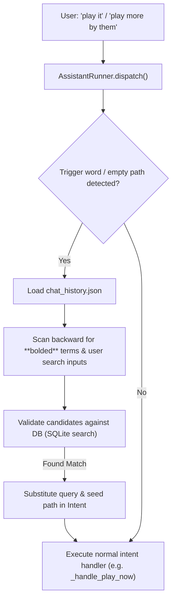

# Implementation Plan - Conversational Chat Memory & Pronoun Resolution

This plan implements dynamic **Conversational Memory** for our local voice assistant (Jarvis) by utilizing the persistent `chat_history.json` (managed via `utils/chat_memory.py`). This allows Jarvis to resolve pronouns/anaphoric references in vocal commands at runtime.

---

## System Overview & Context

Jarvis's chat responses in Flet wrap identified tracks and artists in bold markdown tag strings: `**{track_title}** — {track_artist}` or `**{entity}**`. When a user provides subsequent commands like *"play it"*, *"add that to queue"*, or *"play more by them"*, the regex parser captures these generic pronouns/references. 

By looking back chronologically through previous messages in `chat_history.json` and validating candidate terms against our local SQL database, we can dynamically substitute resolved track and artist queries before dispatching intents.



---

## User Review Required

> [!NOTE]
> **Dynamic Context Overrides:**
> If a user triggers a similarity nav command like *"play more by them"* when nothing is playing (which ordinarily throws an error), the resolver will scan chat history, locate the last-discussed artist (e.g. *"The Beatles"*), query the DB for any track by them to use as a seed track, set `self.engine.current_path` to that track temporarily, and run `_handle_play_more_by` smoothly. 
>
> This gracefully converts error-prone commands into successful voice actions.

---

## Open Questions

We do not have any open questions as the current design aligns precisely with the assistant's architecture and keeps the code decoupled and testable.

---

## Proposed Changes

### Assistant Engine

#### [MODIFY] [assistant_runner.py](file:///c:/Users/CHMI/Downloads/Music_Local/StreamripApp/utils/assistant_runner.py)
* Import `ChatMemoryManager` inside `StreamripApp/utils/assistant_runner.py`.
* Implement a new helper method `async def _resolve_anaphora(self, intent: ai.Intent) -> ai.Intent` that:
  1. Detects anaphora trigger terms (e.g. `"it"`, `"this"`, `"that"`, `"them"`, `"their"`, `"the song"`, `"the artist"`, `"the track"`, `"the tracks"`, `"the music"`, `"the band"`, `"the album"`) in `intent.query`.
  2. Detects implicit anaphoric intents when `self.engine.current_path` is empty (e.g. *"play similar"* or *"play more by them"*).
  3. Instantiates `ChatMemoryManager()` and loads previous bubbles backwards (skipping the user's current message which was already appended).
  4. Extracts potential targets using a robust regular expression matching bold tags `\*\*(.*?)\*\*` or parsing user queries.
  5. Validates candidate tracks or artists against SQLite via `_resolve_query` and `get_all_artists`.
  6. Substitutes the resolved entity back into `intent.query` and/or updates `self.engine.current_path`/`self.engine.current_artist` when executing similarity/artist walks.
* Hook `_resolve_anaphora` at the beginning of `dispatch(self, intent: ai.Intent)` after wizard/confirmation checks.

---

## Verification Plan

### Automated Tests
We will add a dedicated unit test suite [test_chat_memory.py](file:///c:/Users/CHMI/Downloads/Music_Local/StreamripApp/test_chat_memory.py) to assert:
1. **Pronoun/Anaphora Triggering:** Ensure trigger terms are correctly detected.
2. **Reverse Scan & Extraction:** Ensure candidates are parsed correctly from assistant and user bubbles.
3. **Database Validation:** Ensure resolved terms match actual tracks or artists in a mock database.
4. **End-to-End Resolution:** Simulate a history context (e.g. Jarvis: *"Playing **Yesterday** — The Beatles"*, User: *"play more by them"*), invoke `dispatch_text`, and assert successful playback of the resolved artist's tracks.

Run the test suite using:
```bash
python -m unittest test_chat_memory.py
```

### Manual Verification
We will vocally or textually verify the conversational feature in the Jarvis interface:
1. User: *"search for comfortably numb"*
2. Jarvis: *"I found **Comfortably Numb** by Pink Floyd."*
3. User: *"play it"* $\rightarrow$ Jarvis starts playing *"Comfortably Numb"*.
4. User: *"play more by them"* $\rightarrow$ Jarvis starts playing neighbors of Pink Floyd.
